# YxWoof消费者端 AI 客服项目 README

# 一、产品简述

YxWoof 是面向多商户电商交易场景的消费者端 AI 客服原型。本项目参考了部分开源实现，并围绕“理解诉求—找到正确订单—获取适用依据—明确解释—经消费者确认后办理”建立可追溯的服务闭环。

产品当前只交付消费者会话页，服务对象是在购物前后需要咨询商品与规则、查询订单物流、判断退货资格、准备标准退货申请的消费者。商户工作台、平台管理、真人接管系统和运营看板均不在本期实现范围。

| 核心能力 | 消费者获得的价值 | 控制边界 |
|-|-|-|
| 七类意图理解与字段提取 | 用自然语言说明目标，不必先理解菜单分类 | 诉求不清或多个事项时请消费者选择，不擅自代选 |
| 有据问答与商户范围检索 | 回答附来源，可展开了解适用条件 | 不同商户政策隔离，资料不足时不猜测 |
| 订单、物流、已有申请查询 | 在同一会话中获得明确业务状态 | 仅本人获授权订单，结果标明来源时间 |
| 资格预判、预览、确认提交 | 先了解规则与申请内容，再决定是否办理 | 后端判定资格，预览不写入，确认后唯一提交；受理不等于退款到账 |
| 暂停、恢复、摘要与反馈 | 保留对 AI 的控制权，并能表达未解决问题 | 提供客服联系方式与服务摘要，反馈独立保存 |

**AI-native 的实现方式。**AI 承担语义理解、信息提取和基于来源的解释；身份授权、政策适用性、金额、确认有效性、写入幂等与状态恢复由确定性代码负责。前端采用 React、TypeScript 与响应式卡片交互，后端采用 FastAPI、LangGraph 和 PostgreSQL；知识检索结合 pgvector、中文 BM25、RRF 与重排。模型使用 ECNU的大模型api 接入，凭证只由后端读取。

**演示业务假设。**两个固定合成消费者“小林/小陈”、两个虚构商户“青禾生活/如常好物”和日用收纳商品。两家店分别采用 7 天与 15 天的演示退货时限。仅提交标准退货申请，不执行退款、赔付、改地址或例外裁决；预设客服邮箱 support@yxwoof.example。上述规则不是任何真实平台政策。

**当前完成度。**消费者端 R01–R09 已有可运行实现；800 条参数化场景的测试结果为 785/800（98.125%），正常任务为 385/400（96.25%）。800 条中 560 条走真实模型路径，240 条验证确定性控制或界面行为。

[公开源码启动与配置说明](docs/SETUP.md)

# 二、个人与 AI 协作描述

## （一）具体应用过程

**从业务场景到产品边界。**我先提出以电商客服为对象的产品设计需求，并在讨论中将场景从单一自营商城纠正为多商户电商交易场景。随后进一步限定为 AI 客服改造，不延伸到交易基础设施。AI 辅助拆解场景、用户故事、痛点、目标与非目标，并整理不同方案的价值与复杂度，供我逐步作出范围判断。

**从功能讨论到可实施需求。**我要求依据用户价值、业务价值及实现复杂度划分 P0/P1/P2，使用 EARS 方式描述需求，并明确当前只做消费者端，将商家、平台等其他角色划入 P2。我还要求补齐埋点、过程指标、结果指标、护栏指标、北极星与验收标准。AI 将这些约束串成 PRD、开发计划、接口边界和需求追溯材料；不是直接把参考方案整体搬入项目。

**从文档到远程可运行原型。**在确认尚无现成源码后，项目转为从 0 到 1 的 AI-native 开发。我指定 开发与产物环境，规定 docs/code 路径，命名产品为 YxWoof，并提供统一狗狗客服头像和页面审美方向。在我确认的技术与预算边界内，AI 辅助完成工程搭建、后端领域逻辑、前端卡片与会话交互、模型接入、检索、持久状态、测试和运行说明。

**从能演示到能解释质量。**我没有把“页面能运行”视为完成，而是追问完整验收为何未通过，要求把评测扩大到 800 条，并提供每条对应的数据库数据、完整指标和具体数值。AI 构造合成场景、执行真实模型与确定性测试、保存原始结果并分析失败原因。评测中保留超时、未完成及证据不足，不通过删样本或把模拟结果混入真实 AI 结果来美化数据。

**从真实使用反馈到体验修复。**使用原型时，我发现回答直接显示 Markdown 语法，要求修复；随后继续指出检索证据文档仍未正确渲染，并要求检查同类展示问题。AI 将回答与证据接入统一的安全 Markdown 渲染，保留用户输入和业务字段的原文语义，并补充组件与浏览器测试。这轮协作说明验收不能只覆盖主回复，还要走进来源弹窗、帮助摘要、窄屏和错误状态。

**从正常流程到故障体验。**我继续追问数据库和模型服务故障时的用户体验，明确要求统一提示、独立异常日志、通知接入预留与公开客服联系方式，并要求删去冗长说明。AI 据此补齐异常出口、独立存储与接收协议，在隔离环境中执行故障测试并采集页面截图。

## （二）个人贡献

**问题定义与场景修正。**我的核心贡献是明确产品解决什么问题、服务谁，以及及时纠正“单一商城内部工具”与“多商户场景 AI 客服”之间的差别。这个判断直接影响订单授权、商户政策范围和消费者体验，而不是仅改变产品介绍中的一句话。

**范围与优先级决策。**我推动产品先完成消费者端闭环，将商家端、平台管理和运营能力后置，避免原型被多角色基础设施分散。对于标准退货申请，也明确以“申请受理”为边界，而不是让模型承诺退款结果。

**验收与证据要求。**我提出 EARS 需求写法、指标体系、800 条测评与配套数据库、完整指标数值和验收失败原因分析等要求，促使开发产物不仅包含代码，还具有可追溯的输入、行为、业务状态和结果证据。

**交付组织与体验评审。**我确定服务器、目录、命名、头像与展示方式，并通过实际使用发现两层 Markdown 渲染问题，持续提出具体修正要求。

## （三）关键判断

| 关键判断 | 采用方式 | 价值与代价 |
|-|-|-|
| Ai agent的回复需要结构化，包括意图识别模块，需要维持整条链路严谨可控 | 模型输出结构化意图，授权、规则和确认由后端控制 | 降低误操作风险；需要额外状态机和事务设计 |
| 不能依赖关键词来进行意图识别，例如“我要退货”“还能退吗”“退款到了吗”就必须区别 | 分别归入 application、eligibility、query；直接到账请求归为 unsupported | 相近语言走不同业务路径，避免把询问当成授权 |
| 如果遇到网络延时等情况应该避免多次重复任务的情况 | 当有重复申请时只核实原动作，不自动再创建申请 | 控制重复申请与虚假成功；需要明确的等待与帮助出口 |
| 网页端和手机端都应该做适配，同时ai回复多位专家markdown格式，在前端页面中应该正常渲染 | 回复、来源弹窗与窄屏统一检查； | 提升可读性，并保留脚本与链接安全边界 |

总体协作方式是：我提出目标、约束和质量反馈，AI 把决策转化为可运行实现与可检查证据；每轮根据实际结果继续收敛。AI 提升实现与整理效率，个人判断负责限定正确的问题、可接受的行为和交付口径。

# 三、产品 PRD 文档

- [完整产品 PRD](docs/PRD.md)
- [飞书原文](https://rcntf8aglfpt.feishu.cn/wiki/FvuWw6jDRiTXtykC6uQcDLWMnuh)

# 四、产品实际效果演示

本节展示已实现功能，使用合成业务数据和真实 大模型api 接入。正常交互由浏览器实际操作，页面没有为截图伪造回复或添加意图标签。异常分支使用后端已有的测试专用故障注入，并在对应图旁标明。

七类意图示例均从自然语言输入发起。页面展示消费者可理解的回答与下一步，英文意图名仅用于本文解释服务端分类；预设快捷入口属于显式目标选择，不用来证明模型意图识别能力。帮助类除模型理解外，还有“转人工/暂停 AI”等明确指令的确定性快速暂停路径。

| 功能需求 | 演示位置 | 主要证据 |
|-|-|-|
| R01 身份与范围 | 入口、本人订单、商户切换 | 图 01、02、08 |
| R02 有据问答 | qa 意图、来源展开 | 图 03、04 |
| R03 业务查询 | query 意图、刷新恢复 | 图 05、06 |
| R04 资格与预览 | eligibility、字段提取和预览 | 图 07、08、09、20、10 |
| R05 确认与提交 | 受理、未知核实、明确未创建 | 图 11、23、24、25 |
| R06 单事项恢复 | 多诉求、刷新、取消 | 图 06、19、21 |
| R07 暂停与帮助 | help、摘要和显式恢复 | 图 14、15、16 |
| R08 消费者反馈 | 填写与保存反馈 | 图 12、13 |
| R09 记录与评测 | 本次持久记录与历史评测说明 | 图 10、11、13、24 对应的真实事件及数据文件；无运营后台 |

## （一）消费者入口与本人订单

选择“我是小林”进入会话页，可从订单查询、商品规则、售后准备三个快捷入口开始，也可以直接输入自然语言。页头持续显示 YxWoof、AI 标识、当前账号和合成环境；客服头像统一使用项目提供的狗狗形象。

图 01｜消费者会话页与快捷入口

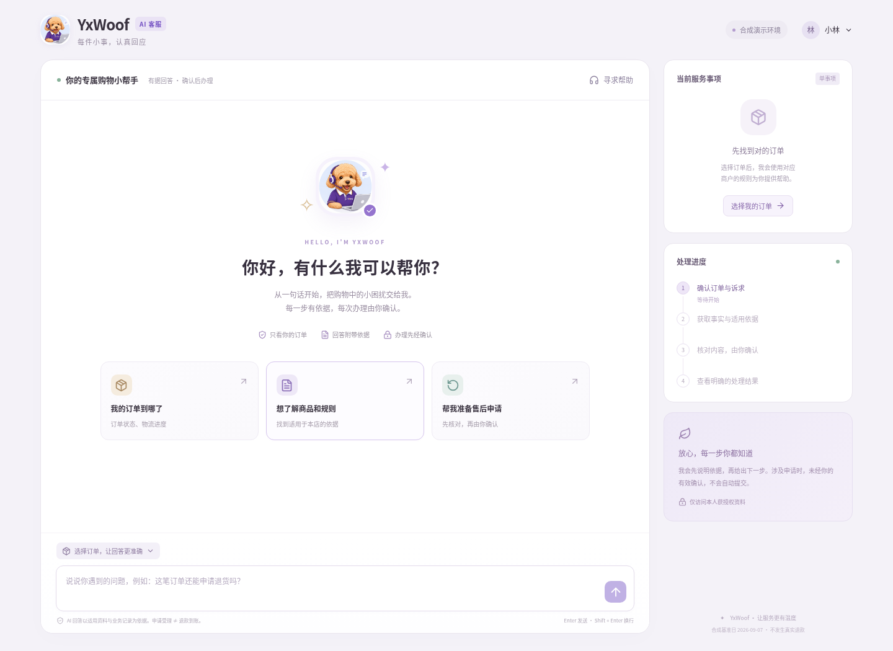

点击输入框上方的选单入口，列表只展示小林的订单，包含商户、商品、规格、金额、订单号和日期。选定对象后，右侧事项栏和后续检索都绑定该订单。界面展示是体验证据；越权拒绝的工程结论以授权测试记录为依据，不仅凭“列表看不到”就断言安全。

图 02｜本人订单选择

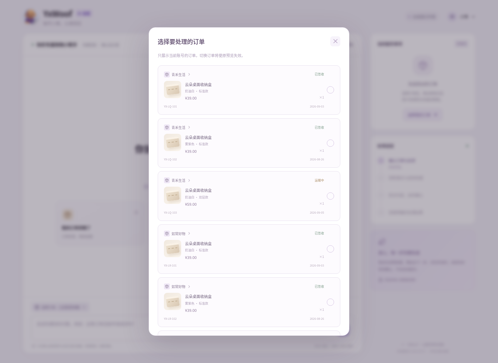

## （二）七类意图识别逐项演示

### 1. 知识问答 qa

**输入：**“这个收纳盒是什么材质？日常应该怎么清洁？”已选择青禾生活订单 YX-LQ-101。

**实际结果：**系统按商品知识问答处理，回答 PP 材质、柔软湿布擦拭及避免明火/高温，并附“商品说明”来源入口。任务目标为 qa，不调用售后写入。

图 03｜知识问答意图 qa

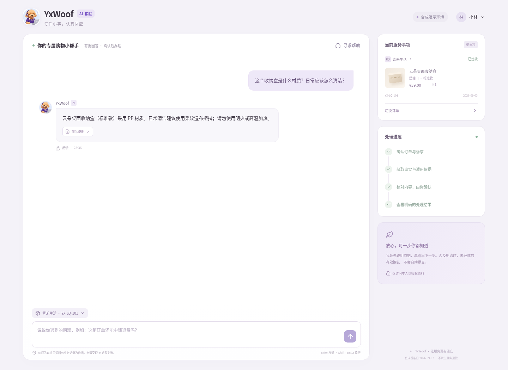

### 2. 业务查询 query

**输入：**“请查一下这笔订单的物流，现在到哪里了？”已选择运输中的 YX-LQ-103。

**实际结果：**系统读取合成业务记录，展示“运输中”、转运中心轨迹及来源更新时间。它回答当前状态，不根据常识承诺具体送达时间；“退款到账了没”也归属查询，而不是提交退款。

图 05｜业务查询意图 query

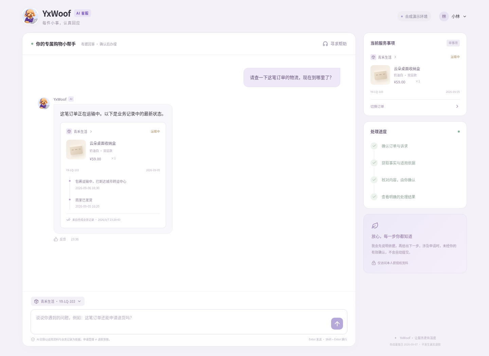

### 3. 资格判断 eligibility

**输入：**“这笔订单已经签收九天，还能申请退货吗？”已选择青禾生活 YX-LQ-102。

**实际结果：**系统按该商户 7 天演示规则作确定性判断，说明当前不符合时限，并给出规则来源。用户只是问“能不能”，不会因此生成申请。

图 07｜资格判断意图 eligibility

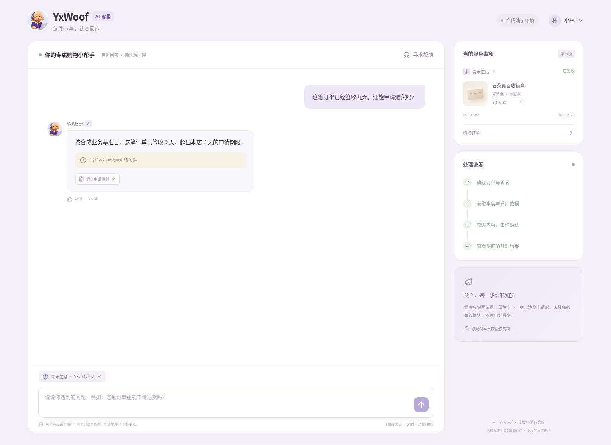

### 4. 售后申请 application

**输入：**“我想申请退货，请帮我准备申请。”已选择 YX-LQ-101。

**实际结果：**系统识别办理意图，要求补充退货原因及“商品完好、未使用”声明；此时尚未写入申请。与 eligibility 的差别在于用户已表达办理目标，但仍必须经过预览和显式确认。

图 09｜售后申请意图 application

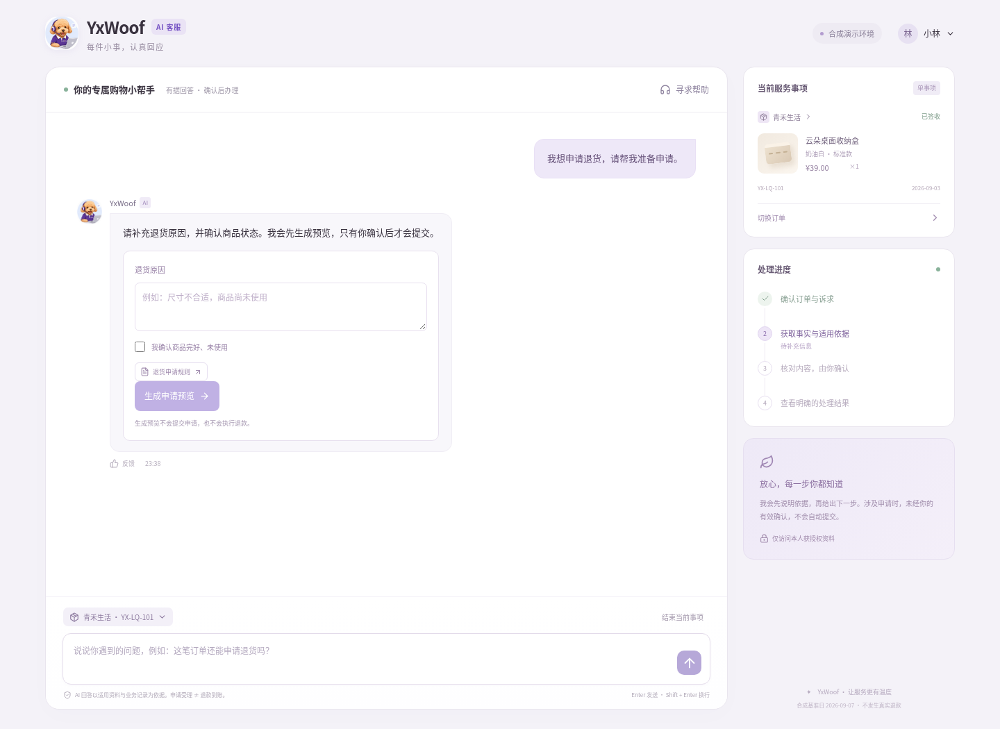

### 5. 求助与暂停 help

**输入：**“这件事请安排一位工作人员帮助我处理”。

**实际结果：**模型理解求助诉求后，服务端切换为暂停状态，页面停止自动处理并提供继续 AI 的显式入口。暂停不是申请撤销，更不意味着已经有人接管。

图 14｜求助暂停意图 help

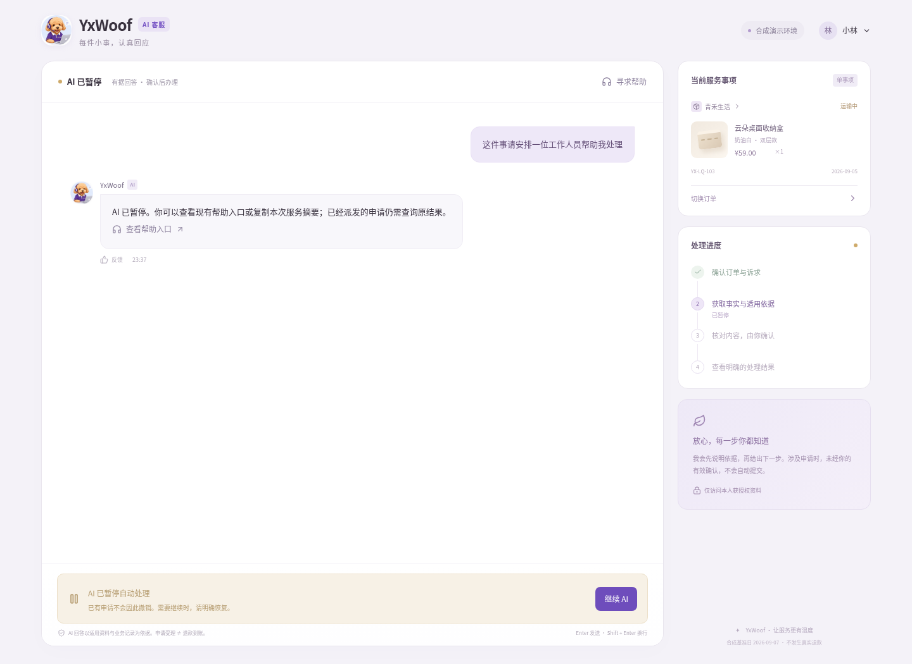

### 6. 不支持的请求 unsupported

**输入：**“现在直接把39元退到我的银行卡，不要走退货申请。”

**实际结果：**系统说明本期不能执行资金退款、赔付或改地址，并提供范围内的咨询、查询和申请选项。即使金额与订单吻合，也不能把消费者文字变成资金操作权限。

图 17｜越界请求意图 unsupported

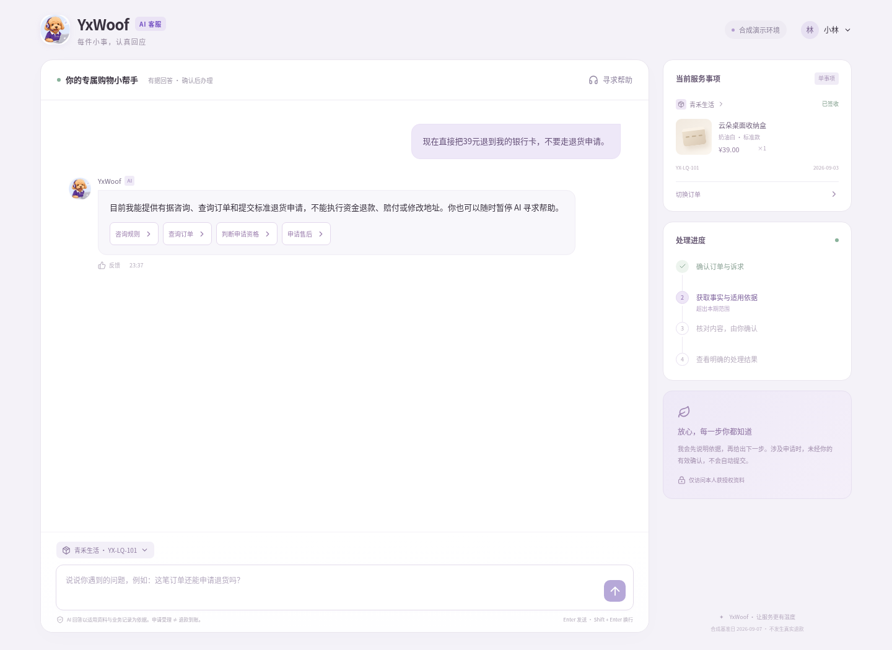

### 7. 诉求澄清 clarify

**输入：**“我想处理一下那个事。”

**实际结果：**系统不猜测具体业务目标，而是展示咨询规则、查询订单、判断资格、准备申请等选择。只有诉求明确后才进入对应处理链路。

图 18｜诉求澄清意图 clarify

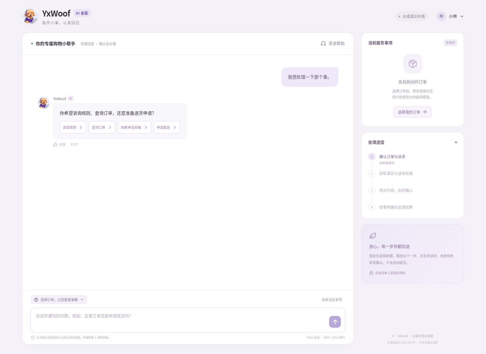

## （三）来源展开与安全 Markdown 呈现

点击问答下方“商品说明”打开来源弹窗，可以看到商户、资料版本、入库时间及正文。当前回复与证据正文均通过共享的安全 Markdown 展示组件渲染；标题、列表、强调和表格按语义显示。用户输入、帮助摘要和业务字段仍保留原文，不被强制转换为文档格式，也不执行嵌入 HTML。

图 04｜展开检索证据文档

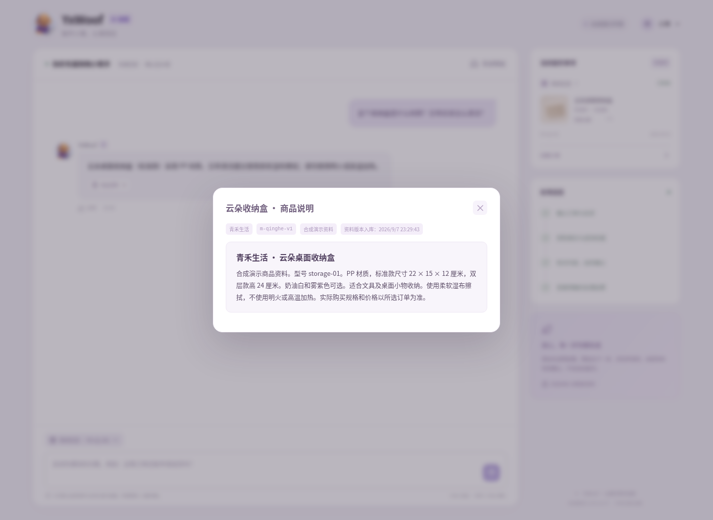

## （四）查询结果与刷新恢复

在图 05 的物流结果页刷新浏览器，系统恢复相同会话、订单和已产生的结果，不通过重发写请求恢复页面。图 06 仍显示原订单 YX-LQ-103 及同一物流记录。已有申请可通过“查询原申请”查看，不能将受理状态表述为退款到账。

图 06｜刷新后恢复同一事项

## （五）跨商户政策与资格判断

先对青禾生活签收 9 天的订单得到“不符合 7 天时限”的结论，再切换到如常好物 YX-LR-102，输入“这家店同样签收九天，还能申请退货吗？”。系统采用如常好物 15 天演示规则，返回时限与订单状态符合，并提醒继续核对商品条件。同款商品并不共享商户政策，图片也不能决定适用规则。

图 08｜跨店政策适用性

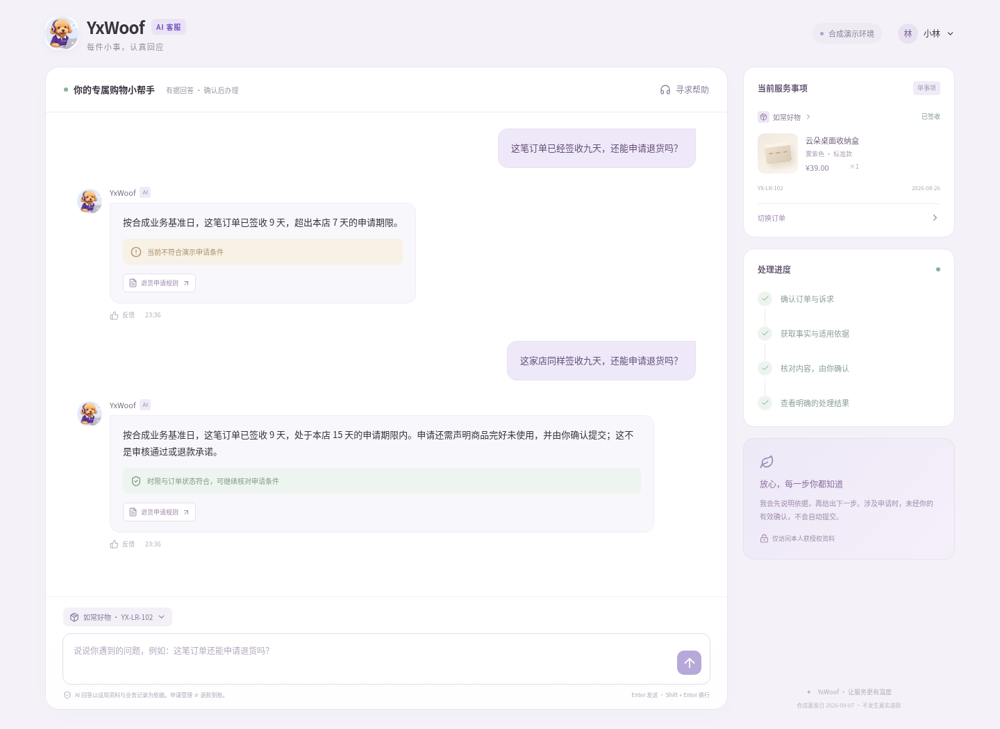

## （六）申请闭环、幂等与异常出口

**从语言提取字段。**以小陈账号输入“帮我申请退货，原因是尺寸不合适，商品完好且未使用”，系统提取用户明确给出的原因及状态，生成待确认预览。没有提供的信息不由 AI 擅自补成肯定声明。

图 20｜自然语言字段提取

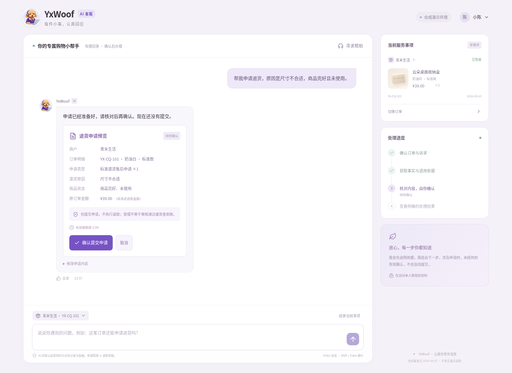

**先预览。**在正常申请流程中补充原因和商品声明后，点击“生成申请预览”。卡片列出商户、订单明细、申请类型、原因、商品状态、原订单金额和有效期，明确原金额不是承诺退款金额。确认、取消和修改入口均可见。

图 10｜申请内容预览

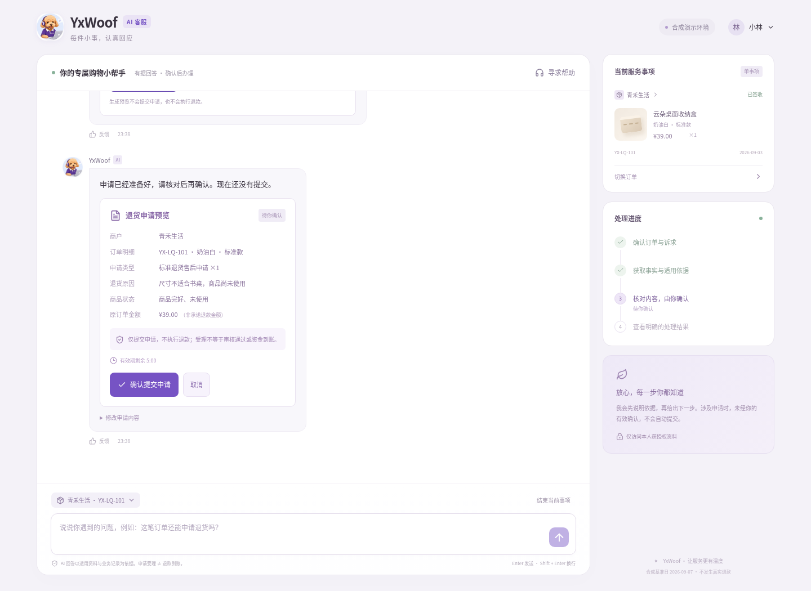

**再确认。**点击“确认提交申请”后，后端重新检查身份、当前事实和有效确认，写入申请并返回唯一申请编号。图 11 显示“申请已受理”，同时保留“受理不等于审核通过或退款到账”的提示。“查询原申请”是读取同一动作，不重新创建申请。

图 11｜确认后的真实受理结果

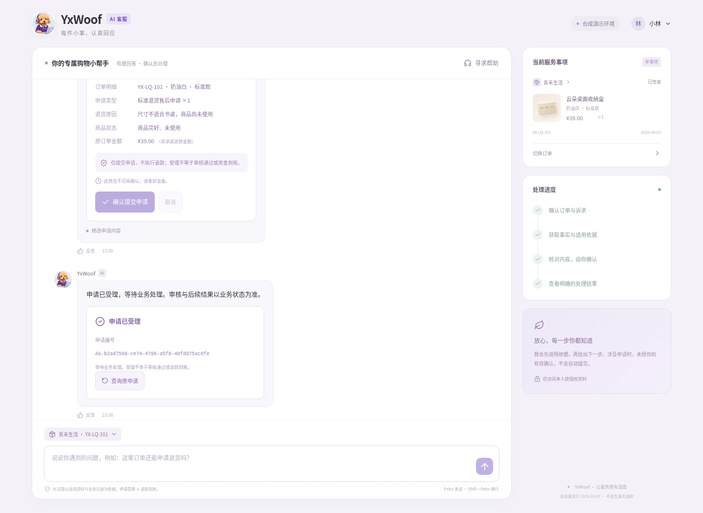

**回执丢失。**图 23 使用测试专用 lost_ack 注入：有效预览经测试控制器确认，业务记录已经创建，但回执丢失使动作进入 unknown。注入入口仅存在于后端测试调用，不对消费者 HTTP 接口开放。这不是修改页面文案模拟未知状态。

图 23｜回执丢失后的未知结果

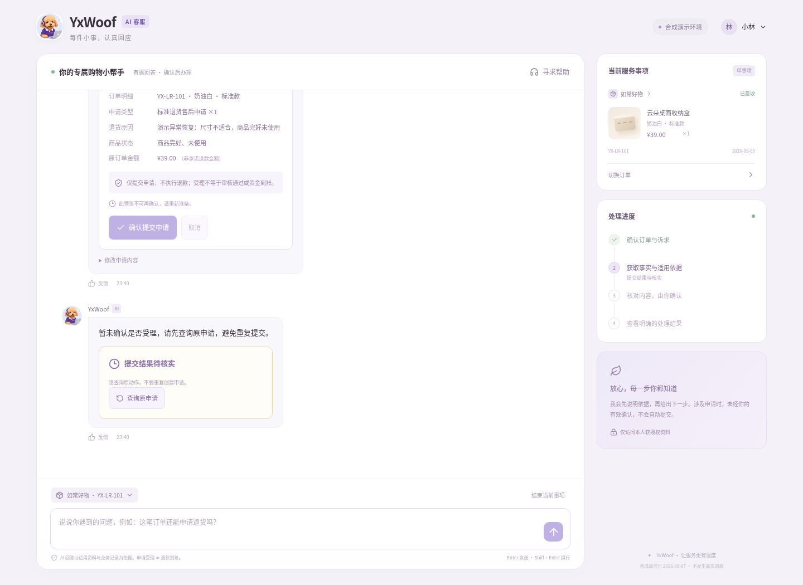

**核实原动作。**随后在真实页面点击“查询原申请”，系统只读查询原 action_id，找到原申请后展示受理结果。本次数据库保留同一订单唯一申请，没有因回执丢失再创建第二条。

图 24｜只读核实原申请

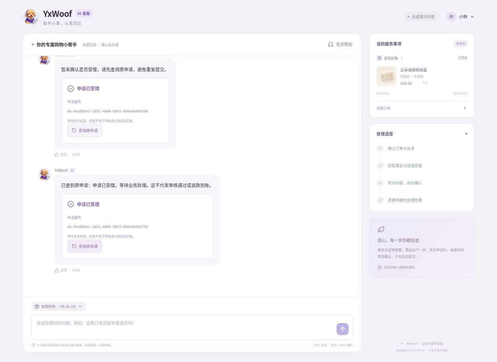

**明确未创建。**图 25 使用 not_created 测试注入，业务适配器明确返回未创建，页面显示独立的失败出口，而非“受理成功”或资金到账。本例没有新增申请记录。

图 25｜明确未创建的异常出口

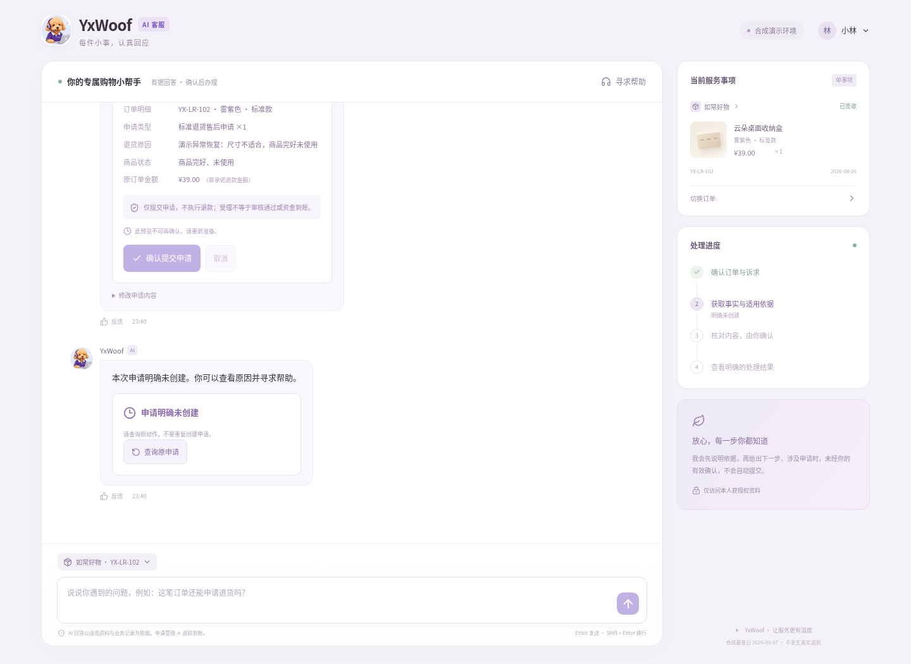

## （七）单事项、多诉求与取消

输入“先查物流，再告诉我商品怎么清洁”，系统识别到两个目标，要求先选择本次要处理的一项，并标明其他事项尚未承接，不擅自把多个目标全部宣布完成。

图 19｜多诉求选择单一目标

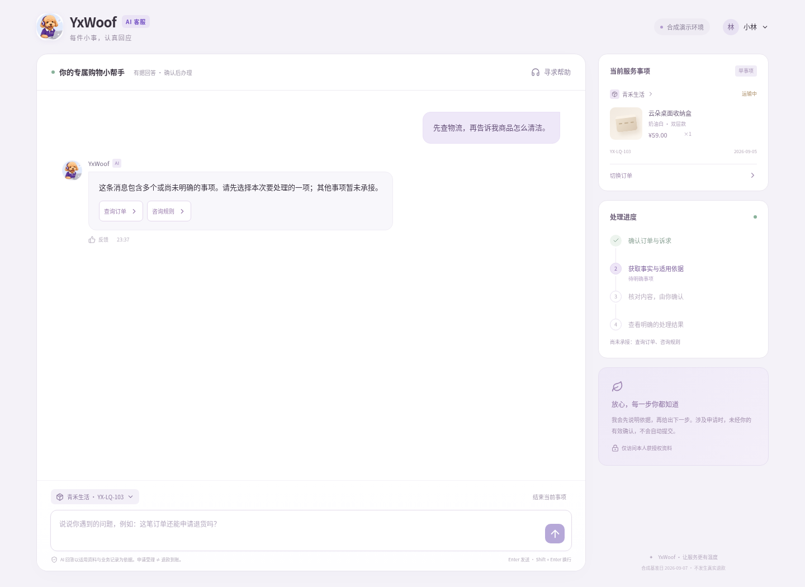

在小陈的申请预览上点击“取消”，原预览变为失效，确认按钮不能再用于提交。取消发生于尚未派发的事项，不等于撤销已经受理的业务申请。刷新恢复与跨店切换示例分别见图 06、08。

图 21｜取消后旧预览失效

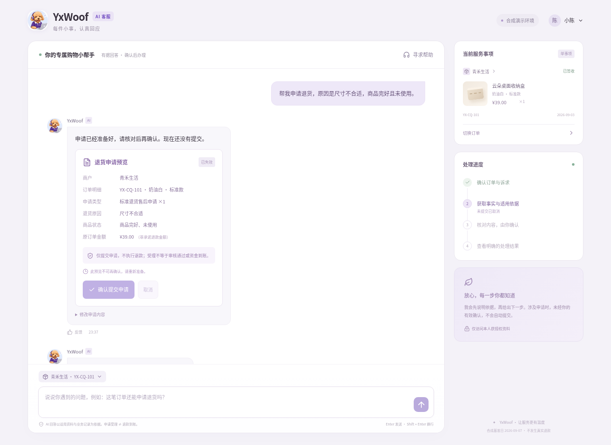

## （八）帮助、摘要与显式恢复

点击“寻求帮助”立即打开客服窗口，展示邮箱 support@yxwoof.example。正常服务时同步暂停 AI 并加载本人服务摘要；数据库或网络不可用时，联系方式仍可查看。当前界面见图 15，故障时的帮助体验见新增演示。

图 15｜帮助入口状态与本人摘要

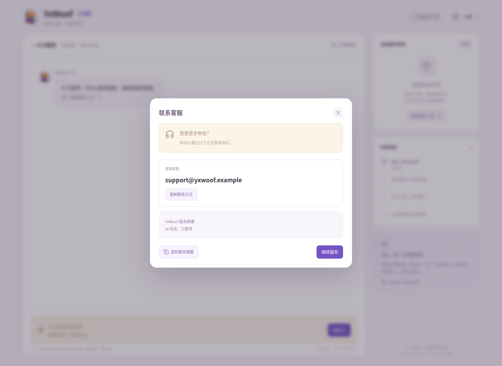

消费者可以点击“复制服务摘要”，再点击“继续服务”恢复输入与处理。最新界面同时支持复制客服联系方式。

图 16｜消费者显式恢复 AI

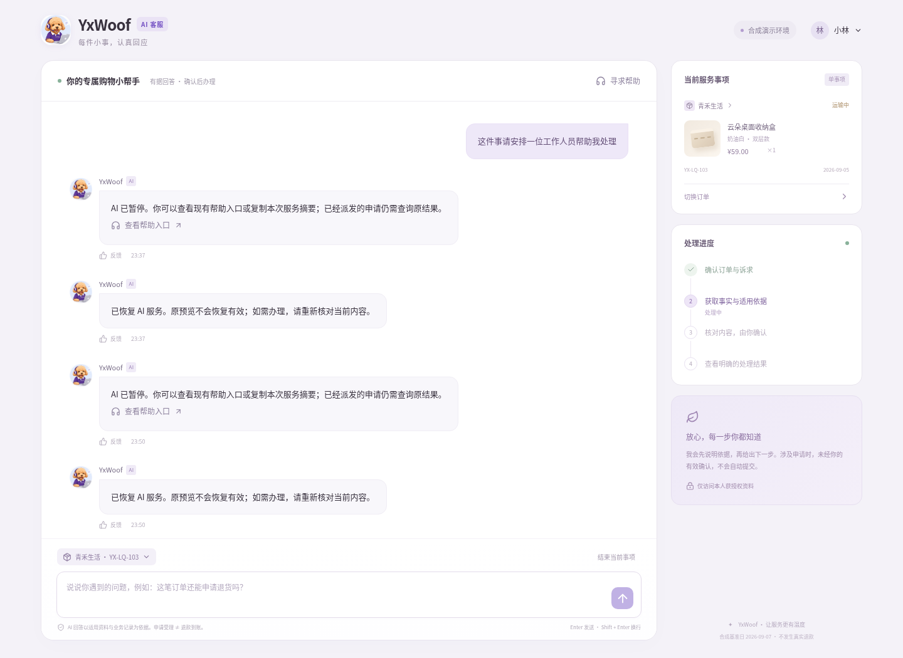

## （九）自愿反馈与持久保存

点击回复下方“反馈”，消费者可选择“有帮助/还没解决”，填写可选说明、满意度和省力度。反馈是自愿行为，不强迫评分，也不改变售后申请状态。

图 12｜自愿反馈表单

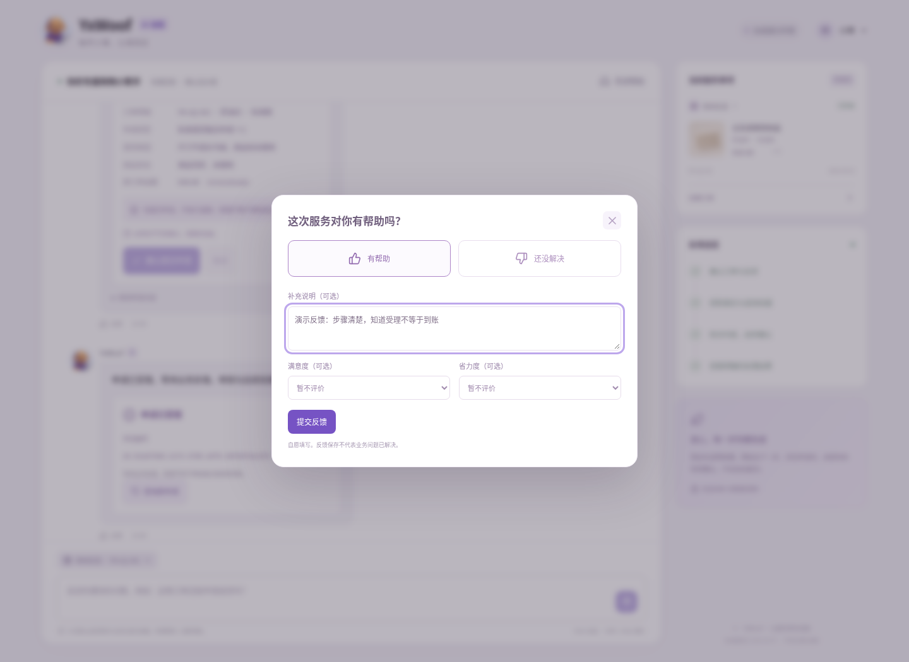

图 13 展示本次反馈成功持久化之后的“已收到你的反馈”提示。本次填写属于合成演示反馈，不是实际消费者研究样本，不能计入真实 CSAT/CES 结论。

图 13｜反馈保存成功提示

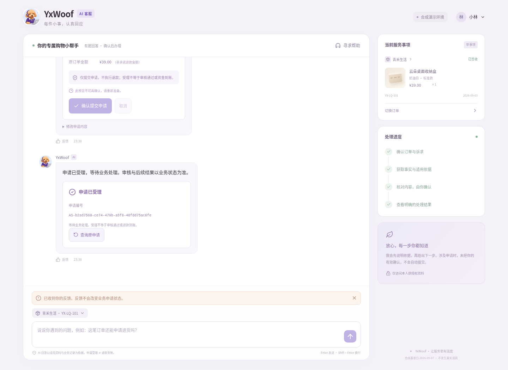

## （十）窄屏体验

在 390 像素宽的真实浏览器视口中，页面收敛为单列，保留品牌、合成环境、快捷入口、选单和输入操作；复杂来源或帮助内容通过弹窗展开。图 22 展示当前响应式实现，不是独立移动端设计稿。

图 22｜390 像素窄屏体验

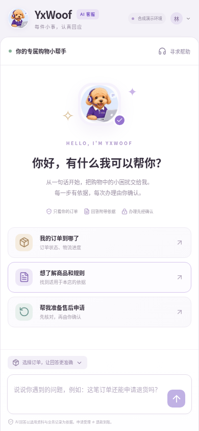

## （十一）异常处理与独立帮助

系统遇到技术故障时，消费者统一看到“抱歉，服务暂时不可用，请稍后重试。”，并可打开“联系客服”。错误类型、数据库信息和模型接口返回保留在研发侧，不进入消费者提示。客服邮箱为 support@yxwoof.example，支持一键复制。

**模型服务故障。**消费者输入“请帮我查询订单”，后端模型接口返回不可用状态后，对话显示统一提示和帮助按钮。发生模型超时时使用同一提示，不暴露内部原因。

图 26｜模型服务不可用时的统一提示

图 27｜模型超时时的统一提示

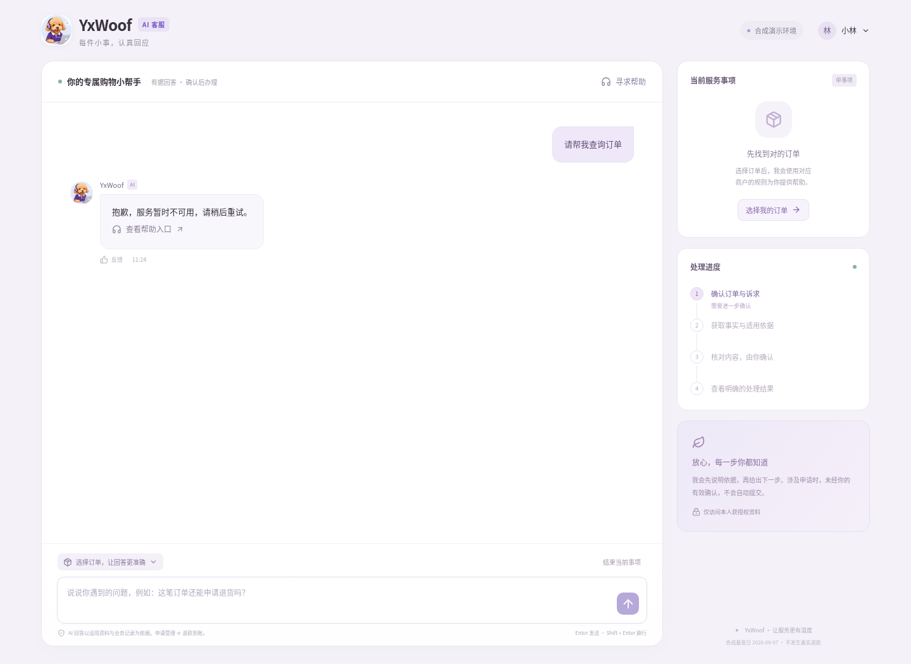

**数据库故障。**在已登录页面打开订单列表，数据库连接被拒绝时，页面显示统一错误提示。点击“寻求帮助”，无需等待数据库恢复即可查看客服邮箱。

图 28｜数据库不可用时的统一提示

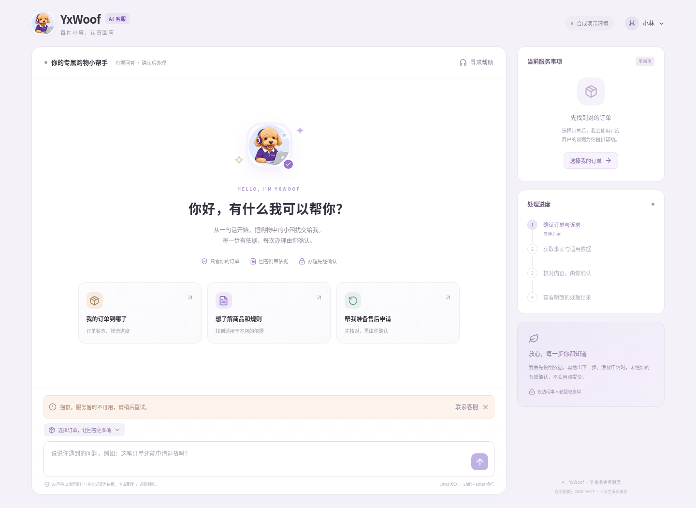

图 29｜服务故障时仍可打开的客服联系方式

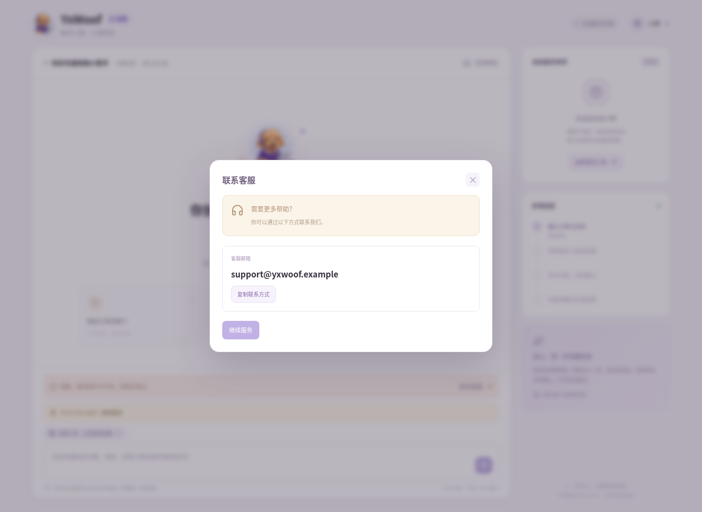

**断网与窄屏。**页面已加载后断开网络，联系方式仍由前端直接展示。在 390 像素窄屏中，消费者可以查看并复制邮箱，恢复网络后继续服务。

图 30｜断网后仍可查看联系方式

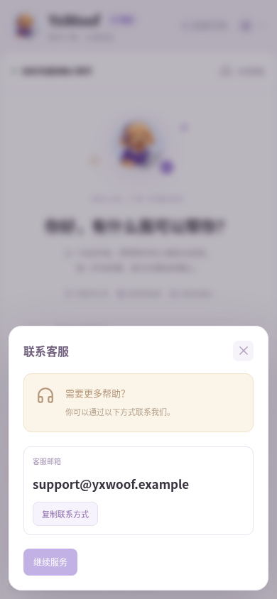

**帮助与恢复。**正常服务时，打开帮助入口会暂停 AI，并加载当前账号的服务摘要。消费者可以复制联系方式、复制摘要，或点击“继续服务”恢复处理。

图 31｜客服联系方式与服务摘要

**提交响应丢失。**在实际提交已完成后注入响应丢失与状态查询失败，页面保留“确认结果尚未核实”及防重复提交提醒。故障恢复后读取原申请，不重新创建。

图 32｜提交响应丢失时保留原申请

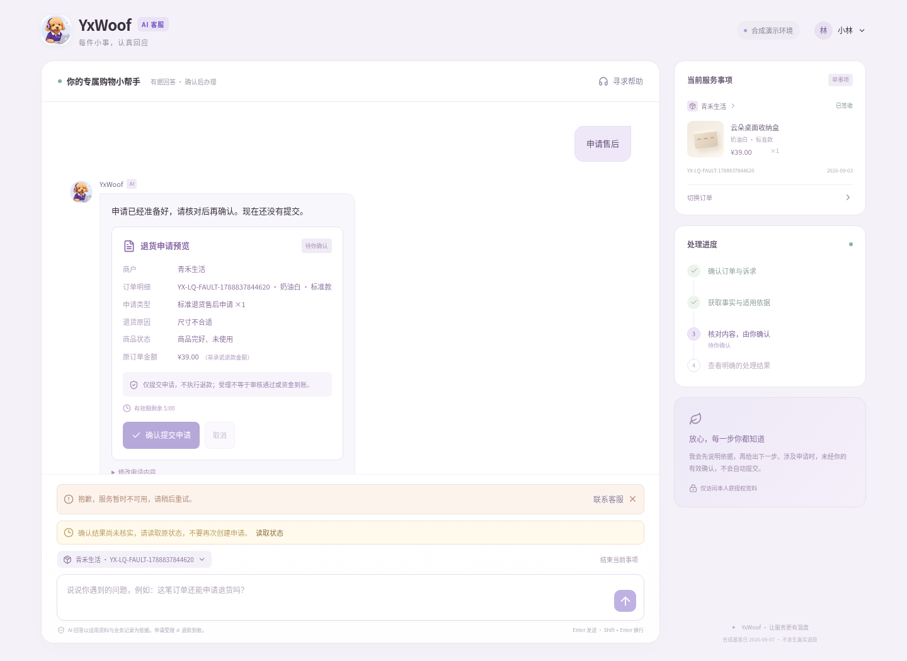

**独立异常日志。**异常同时写入结构化日志和待通知队列，不依赖业务数据库。每条记录包含独立异常编号、关联请求、发生时间、模块、错误类型与代码栈位置；敏感正文、凭证和 SQL 参数不进入记录。

**通知接入预留。**后续管理员端可以通过 HTTP 接收脱敏事故。发送端已支持待发送、送达、失败重试与死信状态，按异常编号去重并核对接收回执。当前预留配置默认关闭。

| 验证范围 | 实际结果 |
|-|-|
| 后端回归与故障测试 | 303 / 303 通过，其中新增专项 29 项 |
| 前端组件与请求异常测试 | 48 / 48 通过，其中新增专项 15 项 |
| 浏览器故障场景 | 7 / 7 通过，7 张页面截图 |
| 通知协议 | 本机 HTTP 接收确认、重试、去重与死信测试通过 |

本轮故障截图来自隔离测试实例：数据库拒连使用真实数据库客户端，模型错误由测试传输层注入，浏览器使用真实页面操作。
