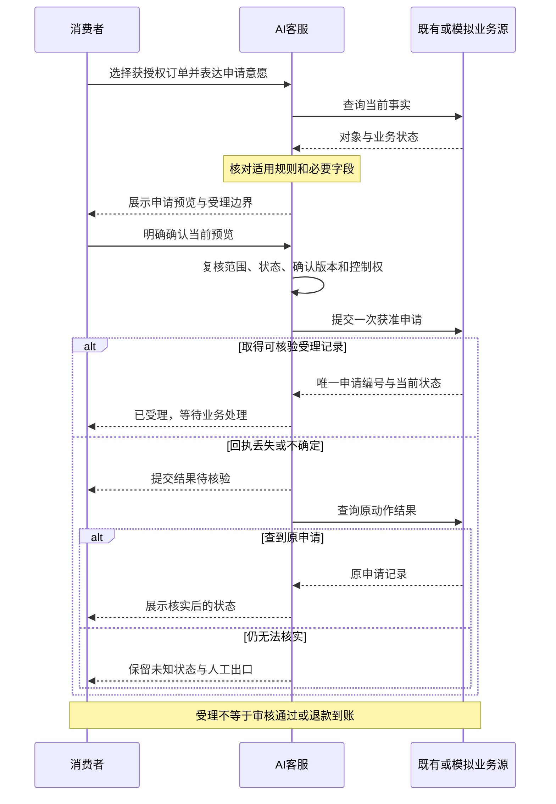

# 多商户电商 AI 客服｜消费者端 PRD v1.1（EARS）

版本：v1.0｜日期：2026-09-07｜状态：产品评审稿，尚未实施或验收。以已形成的场景分析 v0.2、目标与 MVP v0.3、埋点评测 v0.4 为基线；冲突处以从零开发、多商户单事项 P0 及本稿显式范围为准。

# 1. 产品背景与场景

## 1.1 产品定位与范围

本产品是面向多商户电商交易场景的 AI 客服 SaaS 能力，当前版本只交付消费者端体验：理解诉求、定位正确订单、获取适用依据、解释规则、查询状态，并在用户明确确认后提交一种标准售后申请。本项目参考了部分开源实现，并借鉴亚马逊、京东、淘宝等多商户平台的服务场景，不建设电商交易基础设施。

版本：v1.1｜阶段：产品评审｜本期：P0 消费者端 MVP｜P1：消费者体验增强｜P2：商家、平台管理者、人工客服、运营及质检等其他角色侧产品。

[F 已确认事实] 本项目立项时尚无准备好的源码或运行环境，采用从 0 到 1 的 AI-native 开发方式；当前实现对象仅为消费者。实现思路参考部分开源方案，产品范围和需求以本文档为准。

[H 待验证假设] 高频咨询具有重复性；用户存在找错订单、重复解释、看不懂办理进度等问题；AI 能降低操作负担并以可接受成本完成部分任务。实际流量、商户规模、类目、接口成熟度和收益基线尚未确定。

[D 产品设计] 本文的功能、优先级、交互和候选门槛是本版本的设计方案。编号中带“应”的条款为规范性需求；事实、假设与设计建议分别标记，示例数据不代表任何平台的真实政策或本产品的实测成绩。

## 1.2 第一性原理：从诉求到可信结果

消费者需要的是消除不确定性和完成一件事，而不是与机器人多聊几轮。AI-native 的核心是围绕目标与状态选择下一步，在有限授权内使用资料和工具，并以业务事实判断进展。模型负责语言理解和解释；权限、规则适用、确认、唯一提交和状态判断必须由可测试的应用逻辑约束。

| 痛点假设 | 候选根因 | 本期价值与响应 | 衡量依据 |
|-|-|-|-|
| H01 相似订单多，容易办错对象 | 会话中的商户、订单明细和当前目标没有明确绑定 | 选对本人订单；界面持续显示当前对象 | PR-03；A01–A03 |
| H02 回答听起来正确，却不适用于本店或本订单 | 检索缺少商户、时间和版本约束 | 先确定适用范围，再用证据回答 | PR-04/05；A01/A04 |
| H03 说“处理好了”，实际只生成了表单 | 文本生成、申请提交、业务受理被混为一谈 | 显式确认、真实持久化、结果核实与展示 | NS-01、PR-07、GD-04 |
| H04 刷新或超时后不知是否已提交 | 逻辑申请与网络尝试没有稳定关联 | 查询原动作、恢复原申请、避免重复办理 | PR-08、GD-03；A07–A09 |
| H05 想找人工，却被要求继续与 AI 对话 | 退出入口和自动处理状态不明确 | 随时暂停 AI，展示真实既有服务入口 | PR-14、GD-05；A10 |
| H06 反馈没有被记录，错误反复出现 | 缺少问题与回答、动作的关联 | P0 保存消费者反馈；P2 才提供运营归因与改进产品 | OUT-07；P2 R17/R25 |

## 1.3 场景分类与首期范围

分类单位为“一个业务对象上的一个主要服务目标”。按待解决问题的对象划分主场景；商户、渠道、情绪、风险、多诉求和重复咨询是横向标签。一次输入包含多个诉求时，P0 由消费者选择当前处理的一项，其余不自动承接。

| 场景 | 消费者诉求 | 阶段与边界 |
|-|-|-|
| S1 商品与购买决策 | 参数、服务承诺、商品比较 | P0：有资料的事实问答；跨店比较 P2 |
| S2 交易结算与凭证 | 优惠、支付、发票、价保 | P0：已配置规则解释；新增发票等申请动作 P1 独立评审 |
| S3 正向履约 | 订单、物流、催发货、改地址 | P0：订单和物流查询；追加获准消费者动作 P1 |
| S4 使用与保障 | 使用说明、保修条件 | P0：可信资料支持的低风险说明；危险指导不提供 |
| S5 售后处置 | 资格预判、提交申请、查看状态 | P0 核心：一种标准申请；不执行资金退款 |
| S6 账户与持续权益 | 登录、会员、积分 | 使用既有身份能力；范围外给真实服务出口，不重建账户体系 |
| S7 服务复核与争议 | 拒退、例外、服务决定复核 | P0：说明边界并提供既有帮助入口；争议人员工作台 P2 |
| U 未识别或范围外 | 诉求不清、未知类目、非本平台交易 | 澄清或说明限制；未知不得自动归类为无效流量 |

[D MVP 范围盒] 一个受控平台环境、至少两个预置商户数据范围、一个低风险实物类目、中文 Web 文本入口；简单单商户订单，每次选择一个商品明细、一个活动事项，办理一种标准售后申请。多商户用于证明消费者服务的正确归属与隔离，不要求商户入驻页面、多租户运营后台或跨外部平台连接器。

# 2. 目标用户与用户故事

## 2.1 目标用户与阶段

| 角色 | 核心任务与价值 | 本期定位 |
|-|-|-|
| 消费者 | 查清信息、选对订单、确认办理、看懂结果、随时停止 AI | 唯一 P0/P1 产品用户；仅访问本人获授权资料 |
| 商家客服/售后人员 | 承接本店问题、查看证据、处理例外 | P2；本期无接管页面、队列或处理工具 |
| 平台客服/争议专员 | 按案件权限处理跨责任范围事项 | P2；本期无分诊或争议工作台 |
| 商户 AI 运营 | 维护本店知识、规则和服务配置 | P2；本期无商家配置、审核、发布页面 |
| 平台管理员、AI 运营和质检负责人 | 治理权限、质量、版本和成本，审核改进 | P2；本期无管理后台、运营看板或质检中心 |
| 研发、测试及既有业务接口负责人 | 实现消费者服务、提供业务契约、验证安全与质量 | 交付协作方，不因此新增面向该角色的产品模块 |

[H 商业假设] 未来采购方可能是电商平台或商户，具体计费与采购模式尚待验证。采购方不等于本期界面用户；本版本不以完整 SaaS 管理面作为 MVP 前提。

## 2.2 用户故事与需求映射

以下故事用于表达用户价值，属于设计假设，不是访谈原话。

| 故事 | 用户故事 | 需求 / 优先级 |
|-|-|-|
| US01 | 作为有多笔相似订单的消费者，我希望明确当前商户和商品明细，以免办错订单。 | R01/R03/R06；P0 |
| US02 | 作为一次提出多件事的消费者，我希望知道当前处理哪件、哪些还未处理，以免误以为全部已办。 | R06；P0；自动清单 R10 为 P1 |
| US03 | 作为咨询资格的消费者，我希望知道适用依据、限制和缺失信息，以便决定是否申请。 | R02/R04；P0 |
| US04 | 作为准备提交申请的消费者，我希望先确认内容与影响，并能取消未提交的意图，以免误操作。 | R04/R05；P0 |
| US05 | 作为提交时断线或重复点击的消费者，我希望查到原申请真实状态，以免重复建单。 | R05/R06；P0 |
| US06 | 作为希望人工帮助的消费者，我希望随时停止 AI 并打开现有服务入口，而不必先填完表单。 | R07；P0；真实接管工作台 R23 为 P2 |
| US11 | 作为重新打开页面的消费者，我希望在同一会话恢复进度并查询原申请，以免从头办理。 | R06；P0；跨会话事项中心 R11 为 P1 |
| US13 | 作为对回复或办理结果有意见的消费者，我希望提交与当前事项关联的反馈。 | R08；P0 |
| US07/US08 | 作为商家或平台客服，我希望在自身授权范围内查看上下文和在途动作，接管并处理事项。 | R23/R13/R16；P2 |
| US09/US12 | 作为商户或平台运营，我希望审核知识变更并分析失败原因，以便改进 AI 服务。 | R14/R17/R25；P2 |
| US10 | 作为平台质量负责人，我希望按商户、场景和版本查看质量、风险与成本，以便治理服务。 | R24；P2 |

## 2.3 消费者可见范围与外部协作

同一消费者可以咨询自己在不同商户的订单，但每个任务只使用当前对象适用的事实和规则。消费者页面不展示他人的订单、商家内部备注、其他商户私有规则或技术诊断细节。

人工帮助只指向已配置的既有服务入口。打开链接、展示联系方式、复制摘要都不代表创建了工单、进入了队列或已有真人接管。P0 不向第三方自动发送完整对话；如果消费者选择复制服务摘要，仅包含其有权查看的必要信息。

# 3. 产品目标与非目标

## 3.1 产品目标

| 目标 | 预期价值 | 验证依据 |
|-|-|-|
| G1 找对对象、解释有据 | 减少错单、串店规则和错误承诺 | PR-03/04/05，GD-01 |
| G2 常见任务到达明确服务节点 | 减少消费者查找与操作负担，提高可验证完成比例 | NS-01，PR-07，OUT-04 |
| G3 中断、超时和退出时状态可信 | 避免重复申请、状态丢失与虚假成功 | PR-08，GD-02/03/04/05 |
| G4 建立最小可评测闭环 | 用独立业务事实定位问题，支撑消费者端迭代 | GD-09，离线评测结果及消费者反馈 |
| G5 验证增量用户价值与成本可行性 | 证明服务更省力且质量不劣，不以多聊或高调用量为价值 | OUT-04/06/07；同任务对照实验 |

本期直接交付的是信息服务、资格预判和申请受理，不是最终退款、物流履约或争议裁决。“申请已受理”可以完成提交申请任务，但不能被计为退款到账。用户最初诉求与本次约定任务同时保留，不能事后缩小目标来抬高完成率。

## 3.2 产品非目标

| 范围外内容 | 边界处理 |
|-|-|
| 商家、平台管理员、人工客服、运营、质检等其他角色侧功能 | 全部 P2，包括轻量工作台、接管队列、配置页、审核发布页、管理看板；不作为 P0/P1 交付依赖 |
| 商品、订单、支付、仓储物流、账户认证等基础设施 | 仅调用既有能力或明确标注的合成适配器，不设计或重建底层电商系统 |
| 多平台账户接入、商户入驻、租户开户、组织体系、SaaS 计费 | 本期预置受控平台与商户范围；商业化管理能力不纳入消费者 MVP |
| 完整客服 IM、电话网络、排班、通用工单平台 | P0 只有消费者对话界面和既有帮助入口；P2 的客服协作仍以必要集成为边界 |
| AI 最终裁决、商家处罚、自动扣款、资金退款与赔付 | 不给 AI 此类执行权限；仅解释已确认规则及引导既有服务路径 |
| 通用 Agent 平台、模型训练平台、任意工具市场 | 仅实现支撑本应用的有限工具和任务状态，不以多 Agent 架构为产品目标 |
| 并行多事项、跨会话中心、图片、语音、主动通知、多语言 | 按第 4 章 P1/P2 分期；不得隐含加入首版 |

## 3.3 MVP 真实实现与模拟边界

| P0 必须实现 | 允许受控模拟 |
|-|-|
| 实际模型调用、按输入选择路径、检索与来源展示 | 合成商品、订单、物流、规则和业务状态 |
| 消费者身份范围检查、对象绑定、预览版本、有效确认 | 合成环境身份选择器；不代替真实认证 |
| 服务端唯一提交、申请持久化、原动作查询 | 模拟业务适配器；写入必须真实落到演示业务记录 |
| 超时与结果未知处理、同会话恢复、消费者暂停/继续 AI | 受控故障注入、回执丢失和状态变化 |
| 消费者反馈保存、必要事件记录、离线测试与指标计算脚本 | 测试时钟推进分析窗口；不用于性能计时 |
| 人工帮助入口及真实不可用状态 | 配置的演示联系信息必须标为演示，不模拟“真人已接管” |

支撑上述消费者能力的应用后端属于 P0，但不等于建设后台产品。示例知识、商户范围、工具许可和预算通过受版本管理的文件或应用配置提供；诊断和指标通过研发测试脚本及受限导出获得。面向商家或平台的配置、审核、查看与操作界面均为 P2。

真实试点需要可信身份、适用业务规则、可查询的业务结果和隐私要求。写接口缺少可靠唯一性保障或结果查询时，只能开放只读/预览模式，不能宣称办理型 MVP 已完整上线。人工帮助入口如不可用，页面必须如实说明，不以新建工作台解决本期依赖。

## 3.4 实施顺序与复杂度口径

推荐端到端切片：消费者入口与对象识别 → 有据问答和查询 → 预览、确认与唯一受理 → 结果未知与同会话恢复 → 消费者帮助与反馈。事件与测试随对应切片实现，不等待管理后台。

复杂度 C1：静态或简单配置；C2：边界明确的单模块；C3：跨模块状态、授权或异常；C4：外部异步、多任务或高不确定依赖。评级基于从零实现，不是基于已有源码的改动量，不代表人天。通用前后端、存储、模型与测试成本共享，不按功能逐行简单相加。

# 4. 功能清单与优先级

## 4.1 优先级与 EARS 约定

P0：消费者最小服务闭环及其必要安全和评测能力。P1：在 P0 可靠后增加的消费者功能。P2：所有其他角色侧产品，以及依赖更成熟场景与接口的消费者远期能力。P2 不进入本期验收，不要求先建设其简化页面。

需求采用 [EARS](https://alistairmavin.com/ears/) 条件—触发—响应表达。“应”为规范要求；是否交付由优先级决定。R 为功能需求，FL/B 为流程与分支，UI 为交互，TR 为埋点，MR 为计算规则，A/ACC 为验收。

| 模式 | 句式 |
|-|-|
| U 普适 | 系统应…… |
| E 事件驱动 | 当……时，系统应…… |
| S 状态驱动 | 在……状态下，系统应…… |
| X 异常 | 如果……，那么系统应…… |
| O 可选能力 | 在产品包含……能力的情况下，系统应…… |
| C 组合 | 在……状态下，当……时，系统应…… |

## 4.2 P0 功能清单与价值取舍

| 功能包 | 消费者价值 / 业务价值假设 | 最小交付与复杂度 |
|-|-|-|
| R01 身份与商户范围 | 避免错单和数据泄露 / 降低服务风险 | 可信身份、服务端授权检查；C3 |
| R02 有据问答 | 知道为什么、何时适用 / 减少错误承诺 | 分商户检索、来源和缺证据出口；C3 |
| R03 业务查询与选单 | 少找入口、查对状态 / 减少机械查询 | 订单、物流、已有申请；C2，真实接口可能 C3–C4 |
| R04 资格预判与预览 | 理解条件、确认影响 / 减少无效和误提交 | 一种申请规则、必要字段、预览；C3 |
| R05 受控提交与结果核实 | 确实办成且不重复 / 降低副作用和纠纷 | 有效确认、唯一受理、未知结果查询；C3 |
| R06 单事项与同会话恢复 | 不中断、不丢进度 / 减少重复申请 | 对象切换、确认失效、刷新续接；C3 |
| R07 暂停 AI 与人工帮助入口 | 自主退出 / 避免服务强迫和虚假承诺 | 暂停/继续 AI、既有入口、消费者可复制摘要；C2 |
| R08 消费者反馈 | 表达未解决问题 / 获得改进线索 | 反馈提交、关联保存与结果提示；C2 |
| R09 必要记录与运行保护 | 服务可信稳定 / 可验证质量与成本 | 事件、预算、配置开关、研发测试脚本；C3；无角色后台 |

## 4.3 P0 详细功能需求

### 4.3.1 R01：消费者身份与商户范围

| 需求 ID / 模式 | EARS 需求 |
|-|-|
| R01.01 / U | 系统应为每个任务维护可信消费者身份、当前授权范围及待确定或已绑定的商户和业务对象。 |
| R01.02 / E | 当收到查询、对象绑定、确认、恢复或来源展开请求时，系统应在返回私有内容或派发动作前执行服务端授权检查。 |
| R01.03 / X | 如果请求资源不在当前消费者授权范围内，那么系统应拒绝访问且不向用户、模型上下文或普通统计日志泄露其私有内容。 |
| R01.04 / X | 如果真实数据入口无法取得可信身份或授权结果，那么系统应禁止私有业务访问；合成身份选择器仅可用于演示数据。 |

### 4.3.2 R02：分商户证据问答

| 需求 ID / 模式 | EARS 需求 |
|-|-|
| R02.01 / E | 当任务需要检索规则或知识时，系统应将可用候选限制为当前授权范围及适用商户、对象、时间和发布版本的资料。 |
| R02.02 / E | 当展示基于知识或政策的实质回答时，系统应提供支撑关键结论的来源及必要适用限制。 |
| R02.03 / X | 如果所需证据缺失、过期或相互冲突且无已确认的适用关系，那么系统应停止输出确定的个案结论，并提供说明限制的既有帮助入口。 |
| R02.04 / X | 如果用户输入、资料或工具返回包含要求扩大权限、跳过确认或执行未准动作的指令，那么系统应将其作为不可信内容处理并维持既定约束。 |
| R02.05 / E | 当用户咨询未绑定具体订单的一般规则时，系统应明确该回答的商户及适用条件，不将一般说明表达为个案已获批准。 |
| R02.06 / X | 如果必要事实无法从可信资料或业务系统核实，那么系统应标记该事实未知，不自行生成金额、时限、库存或审批结果。 |

### 4.3.3 R03：业务查询与对象选择

| 需求 ID / 模式 | EARS 需求 |
|-|-|
| R03.01 / X | 如果当前诉求存在多个可能的获授权订单明细，那么系统应要求用户选择可辨识对象，不猜测所指订单。 |
| R03.02 / E | 当展示订单选择卡时，系统应提供获授权候选的商户、商品/规格、订单识别信息及区分订单所需的日期或状态。 |
| R03.03 / E | 当对象选择通过服务端核对时，系统应将后续业务查询绑定到该对象及其商户范围。 |
| R03.04 / E | 当展示订单、物流或已有申请查询结果时，系统应展示事实源提供的状态与更新时间，并区分查询时间和业务状态时间。 |
| R03.05 / X | 如果查询失败、字段不完整或状态过旧而不能支撑判断，那么系统应说明限制并提供安全重查或既有帮助入口，不伪装查询成功。 |

### 4.3.4 R04：资格预判与申请预览

| 需求 ID / 模式 | EARS 需求 |
|-|-|
| R04.01 / E | 当消费者请求支持范围内的售后资格判断时，系统应按当前可信事实和已启用规则给出可申请、不符合或无法自动判断的结果及依据。 |
| R04.02 / X | 如果缺少本类申请规则要求的必要材料，那么系统应仅索取尚缺且允许收集的字段，不重复索取仍有效的信息。 |
| R04.03 / E | 当用户选择继续办理支持的申请时，系统应生成包含商户、订单明细、申请类型、原因、待提交字段和动作影响的预览。 |
| R04.04 / S | 在申请预览等待确认的状态下，系统应展示“受理不等于审核通过或退款到账”的说明。 |
| R04.05 / E | 当用户修改影响申请内容的字段时，系统应使此前预览与确认版本失效，并要求对更新内容重新确认。 |
| R04.06 / X | 如果当前诉求涉及未支持的组合拆退、金额分摊、复杂类目或例外审批，那么系统应停止自动申请路径并提供既有帮助入口。 |

### 4.3.5 R05：有效确认、唯一提交与业务结果

| 需求 ID / 模式 | EARS 需求 |
|-|-|
| R05.01 / S | 在不存在匹配当前消费者、对象、动作、未过期预览版本的有效确认的状态下，系统应禁止派发申请创建动作。 |
| R05.02 / E | 当服务端收到提交确认时，系统应重新核对身份范围、业务状态、适用规则、预览版本和 AI 自动执行许可。 |
| R05.03 / X | 如果提交前复核条件与确认预览不再一致，那么系统应拒绝使用旧确认派发，并引导核对更新后的预览。 |
| R05.04 / E | 当全部提交条件核对通过时，系统应按同一逻辑申请意图的唯一性规则派发获准申请，并保存动作与申请记录关联。 |
| R05.05 / X | 如果收到同一逻辑申请意图的重复提交请求，那么系统应返回原动作的已知状态或进入核验，不创建第二个非预期有效申请。 |
| R05.06 / X | 如果写入请求超时或回执不能证明是否已受理，那么系统应进入“提交结果待核验”，先查询事实，不盲目重新派发创建动作。 |
| R05.07 / E | 当取得匹配原动作的权威受理记录时，系统应展示唯一申请编号、当前业务状态、更新时间和下一步说明。 |
| R05.08 / X | 如果核验仍不能确认业务结果，那么系统应保留未知状态和既有帮助入口，不将其自动判为未创建、成功或最终解决。 |
| R05.09 / E | 当取得明确拒绝或明确未创建的权威结果时，系统应说明原因；再次办理必须沿当前有效确认与核对路径进行。 |
| R05.10 / E | 当取消、暂停 AI 或对象切换在服务端先于动作派发生效时，系统应阻止旧意图产生新的业务副作用。 |

### 4.3.6 R06：单活动事项与同会话恢复

| 需求 ID / 模式 | EARS 需求 |
|-|-|
| R06.01 / U | 系统应在一个会话内最多维护一个当前活动办理事项，并保留已有业务申请的关联记录。 |
| R06.02 / E | 当用户提出多个办理诉求时，系统应请求选择当前处理事项，并明确其他诉求尚未承接。 |
| R06.03 / E | 当用户确认切换当前商户或订单对象时，系统应使旧对象上未使用的预览和确认失效。 |
| R06.04 / S | 在已有申请已经受理的状态下，系统应保留该业务记录，不因会话关闭、任务切换或页面刷新撤销申请。 |
| R06.05 / E | 当消费者恢复同一会话时，系统应重新验证访问范围，并恢复有效步骤或查询原申请状态；原 AI 暂停状态应保持。 |
| R06.06 / X | 如果无法可靠恢复对象、预览版本或动作结果，那么系统应要求安全重选或查询原记录，不从历史回复推断业务结果。 |

### 4.3.7 R07：消费者暂停 AI 与既有帮助入口

| 需求 ID / 模式 | EARS 需求 |
|-|-|
| R07.01 / U | 系统应在消费者会话中提供无需完成业务表单即可使用的人工帮助入口。 |
| R07.02 / E | 当系统收到消费者明确人工请求时，系统应暂停该事项的新自动业务动作及生成式业务回复，并使尚未使用的确认失效。 |
| R07.03 / S | 在 AI 已暂停的状态下，系统应仅保留必要状态告知和此前在途写入的受限只读结果查询，不自动恢复办理。 |
| R07.04 / E | 当消费者打开人工帮助时，系统应展示配置的既有服务链接或联系方式，并明确打开入口不代表已接通真人或已受理工单。 |
| R07.05 / X | 如果未配置有效服务入口或已知入口不可用，那么系统应如实显示不可用说明，不生成虚假的队列、在线人员或承诺时限。 |
| R07.06 / E | 当消费者选择复制服务摘要时，系统应仅复制其有权查看的诉求、对象、已知状态和未知事项，不自动发送完整对话给其他角色。 |
| R07.07 / C | 在 AI 已暂停的状态下，当消费者明确选择继续 AI 时，系统应重新核对授权、对象及业务状态后恢复允许步骤，并对待提交内容重新生成预览。 |

### 4.3.8 R08：消费者反馈

| 需求 ID / 模式 | EARS 需求 |
|-|-|
| R08.01 / E | 当消费者提交反馈时，系统应将反馈关联至当前任务及相关回答或申请记录，并保存反馈类型、可选说明和提交时间。 |
| R08.02 / E | 当反馈保存成功或失败时，系统应分别展示已收到或提交失败状态，并允许安全重试而不重复记录同一提交。 |
| R08.03 / U | 系统应将消费者反馈与业务完成状态、规则版本分开保存，不因点赞、差评或“已收到”自动修改业务结果或启用新知识。 |

### 4.3.9 R09：应用记录、预算与研发评测

| 需求 ID / 模式 | EARS 需求 |
|-|-|
| R09.01 / U | 系统应保留任务、对象、来源、预览、确认、动作、结果和用户展示的必要关联，以支持独立业务核对与离线测试。 |
| R09.02 / U | 系统应分别标识合成与真实数据、运行版本和测试时钟模式，不混合报告效果。 |
| R09.03 / E | 当执行冻结测试集时，应用评测脚本应依据独立业务真值输出任务结果、禁止动作断言及第 8 章 P0 指标明细，不依赖管理页面。 |
| R09.04 / X | 如果单轮时间、调用次数或费用达到配置预算，那么系统应停止新增不允许的调用，显示真实状态，并保留已派发写入的结果查询路径。 |
| R09.05 / S | 在某动作或场景被应用配置停用的状态下，系统应阻止该范围的新执行，保留已有业务记录和必要查询，不要求平台控制台。 |
| R09.06 / E | 当模型、提示、规则或流程配置变更进入发布测试时，应用测试工具应执行受影响场景及非目标商户的隔离回归，并保留版本对应的结果。 |

## 4.4 P1：仅消费者体验增强

| 功能 / 价值 / 复杂度 | EARS 方向性需求 |
|-|-|
| R10 自动拆解与串行清单｜减少多诉求遗漏｜C3 | 在产品包含多事项能力的情况下，系统应展示逐项目标、对象和状态，并在每个写动作前独立获取有效确认。 |
| R11 跨会话事项中心｜减少恢复负担｜C3–C4 | 在产品包含跨会话续接能力的情况下，系统应基于消费者授权恢复原事项并查询最新业务状态，不依据对话相似度重复创建申请。 |
| R12 图片材料理解｜减少手填｜C3 | 在产品包含图片材料能力的情况下，系统应说明用途、限制和处理状态，并要求消费者确认会影响申请的关键识别字段。 |
| R15 更多消费者获准动作｜减少跨页面办理｜C3–C4 | 在产品包含新增申请动作的情况下，系统应为每种动作独立定义授权、预览、确认、唯一性和结果查询契约；资金退款与裁决仍不在授权范围。 |

## 4.5 P2：其他角色侧产品与远期能力

以下仅定义未来边界，不进入本期页面、埋点或上线门槛。凡面向商家、平台管理者、人工客服、运营、质检等非消费者角色的能力，均归入 P2，无 P0/P1 例外。

| 功能 / 主要用户 / 复杂度 | EARS 方向性需求 |
|-|-|
| R13 人工 Copilot｜客服人员｜C3 | 在产品包含人工辅助能力的情况下，系统应向获授权客服提供有来源的摘要和建议，并由客服决定是否采用。 |
| R14 商家知识与服务配置｜商户运营｜C3 | 在产品包含商家配置能力的情况下，系统应限制其仅维护本店获授权资料，并按审核与生效规则发布。 |
| R16 争议复核辅助｜平台争议人员｜C3–C4 | 在产品包含争议辅助能力的情况下，系统应整理获授权证据与时间线，将最终决定留给有权主体。 |
| R17 失败归因与改进建议｜运营/质检｜C3 | 在产品包含归因能力的情况下，系统应区分知识、规则、接口、交互与服务供给问题，并由有权人员确认改进事项。 |
| R23 人工接管工作台｜商家/平台客服｜C3–C4 | 在产品包含接管能力的情况下，系统应按授权创建交接记录，区分待承接与真实接管，并控制 AI 与人工的办理权限及在途动作。 |
| R24 平台 AI 管理与质量看板｜平台管理员｜C3 | 在产品包含管理能力的情况下，系统应按角色和事项权限提供服务配置、版本控制、质量与成本指标，不默认开放全平台私有会话。 |
| R25 反馈审核与知识发布闭环｜商户/平台运营｜C3 | 在产品包含改进闭环能力的情况下，系统应关联反馈、人工归因、授权审核、范围回归和启用记录，未通过审核的候选不自动发布。 |
| R18 主动通知｜消费者｜C4 | 在产品包含主动通知能力的情况下，系统应依据已获准触达范围发送有业务依据的更新，并提供退订与频次控制。 |
| R19 跨商户比较｜消费者｜C3–C4 | 在产品包含跨商户比较能力的情况下，系统应只比较消费者有权获知的可比信息，并明确每个结论的商户、时点和条件。 |
| R20 多语言｜消费者｜C3 | 在产品包含多语言能力的情况下，系统应保持规则和业务含义一致，并对每种支持语言独立评测。 |
| R21 既有语音渠道接入｜消费者｜C4 | 在产品包含语音入口的情况下，系统应依托既有渠道处理识别误差和确认，不建设电话网络。 |
| R22 并行多事项｜消费者｜C4 | 在产品包含并行办理能力的情况下，系统应隔离各事项状态与许可，并避免并发导致的重复或冲突副作用。 |

# 5. 主流程与关键分支

## 5.1 主流程与业务对象

消费者进入 → 表达目标 → 选择当前事项与获授权对象 → 获取事实和适用依据 → 回答/查询，或生成申请预览 → 用户确认 → 提交前核对 → 唯一提交与结果查询 → 展示具体结果 → 可选反馈。任一阶段可停止 AI 并打开既有帮助入口；P0 不创建内部接管队列。

| 对象 | 含义 | 边界 |
|-|-|-|
| request_id 原始请求 | 一次服务诉求，可能包含多个尚未承接的目标 | 保留原始最终诉求，不事后缩小目标 |
| task_id 服务任务 | 一个对象上的一个约定目标 | P0 每会话最多一个活动事项；同一任务不因重试重新计数 |
| preview_id / confirmation_id | 待提交内容及其确认版本 | 身份、对象、内容、必要事实或执行许可变化时失效 |
| action_id / attempt_id | 一次逻辑动作 / 一次网络尝试 | 重复请求不是新意图；跨刷新仍保持唯一性 |
| application_id 业务申请 | 实际被业务源创建的记录 | 受理、审核、到账是不同阶段 |
| automation_state / control_version | 消费者本事项的 AI 自动处理开关与版本 | 只表示 AI 可否继续；不表示人工已接管 |

## 5.2 售后申请关键时序

下图展示单事项申请及提交结果未知分支。图中的“控制权”指当前消费者事项的 AI 执行许可；“人工出口”指既有帮助入口，不表示本期建设人工工作台。演示环境使用明确标注的合成业务适配器，真实试点使用既有权威接口。

## 5.3 四条端到端路径

| 流程 | EARS 流程要求 | 结果 |
|-|-|-|
| FL-01 有据问答与查询 | 当消费者提出查单或个案规则问题时，系统应先消除对象歧义，再以适用事实与依据回答。 | 正确结果已展示；或真实说明限制 |
| FL-02 标准申请 | 当消费者决定提交本期支持的申请时，系统应依次完成必要材料、预览、有效确认、提交前核对、唯一写入和业务结果查询。 | 受理且展示；或拒绝、未知、取消分别可见 |
| FL-03 停止 AI 与求助 | 当消费者明确请求人工帮助时，系统应暂停自动办理并展示真实既有入口，不声明已转入队列或已接通真人。 | AI 已暂停；入口可用性及点击状态可见，不计 AI 完成 |
| FL-04 消费者反馈 | 当消费者对本次服务提交反馈时，系统应保存与任务的关联并展示提交结果，不改变原业务状态。 | 反馈已收到或明确失败；无运营审核页面 |

## 5.4 状态模型与可见文案

任务进度、业务申请状态和 AI 是否暂停分别存储。消费者暂停 AI 时，原申请可能已经受理或仍然结果未知；暂停不能撤销已派发请求。完成申请提交任务不代表消费者最初的退款诉求已经解决。

| 维度 / 状态 | 消费者可见表达 | 退出依据与不变量 |
|-|-|-|
| 任务：待选对象 | 请确认要处理的订单 | 选择获授权明细后继续 |
| 任务：待补信息 | 还需要这些材料 | 仅索取必要缺项；可直接求助 |
| 任务：处理中 | 正在查询 / 准备申请 | 返回结果、明确失败或未知；加载不算完成 |
| 任务：待确认 | 请核对申请内容 | 有效确认、取消或预览失效 |
| 业务：提交结果未知 | 暂未确认是否受理，请先查询原申请 | 权威受理/明确未创建才结束未知；不盲目重提 |
| 业务：已受理待处理 | 申请编号、当前业务状态、更新时间 | 提交任务可完成；审核和资金状态另由业务源决定 |
| 任务：完成具体目标 | 已查询订单 / 已提交申请 | 结果正确、安全、有证据且已展示 |
| 任务：用户取消或未继续 | 未提交已取消 / 当前未继续 | 沉默不算完成；关闭页面不撤销已有申请 |
| AI：已暂停 | AI 已暂停，可打开现有客服入口 | 仅消费者明确选择继续 AI 后重新核对并恢复 |
| 帮助入口：可用 / 未配置 / 已打开 | 可联系现有客服 / 当前无可用入口 / 已打开外部入口 | 仅说明消费者动作，不维护等待人工或人工接管状态 |

## 5.5 关键分支

| 分支 | EARS 行为约束 | 验收 |
|-|-|-|
| B01 对象歧义 | 如果无法唯一确定订单明细，那么系统应要求选择，不将模型猜测作为绑定依据。 | A03 |
| B02 无权访问 | 如果对象或来源超出消费者权限，那么系统应拒绝访问且不泄露私有详情。 | A02/A11 |
| B03 缺失或冲突规则 | 如果证据无法支撑结论，那么系统应说明限制并提供安全下一步。 | A04 |
| B04 旧确认 | 如果预览已失效，那么系统应拒绝旧确认并要求确认当前内容。 | A05/A06 |
| B05 重复提交 | 如果同一意图已有动作记录，那么系统应查询原结果，不新增重复副作用。 | A07 |
| B06 写入后丢失回执 | 如果无法确定是否受理，那么系统应保留未知并查询原动作。 | A07/A08 |
| B07 页面刷新 | 当消费者恢复同一会话时，系统应重新授权并保留原事项、AI 暂停和申请状态。 | A09 |
| B08 求助与在途动作并发 | 当人工请求在服务端生效时，系统应阻止新的自动办理；已派发动作应继续受限只读查询并如实展示。 | A10 |
| B09 既有帮助入口不可用 | 如果没有可用入口，那么系统应说明真实限制，不声称已交接或已接通。 | A10 |
| B10 不可信内容注入 | 如果内容要求跳过业务约束，那么系统应维持授权与确认规则。 | A12 |
| B11 多诉求 | 当收到多个诉求时，系统应请消费者选择当前项并说明未承接部分。 | A17 |
| B12 超预算或依赖故障 | 如果达到预算或关键依赖不可用，那么系统应停止新增不允许动作并显示真实状态及出口。 | A08/A18 |

# 6. 页面设计与交互说明

## 6.1 页面范围与信息层级

P0 只有消费者侧 PC-01 AI 客服会话页，订单选择、来源详情、申请预览、帮助和反馈均以页内卡片或抽屉承载。桌面与窄屏保持同一业务语义，不扩展独立商家或平台界面。

| 页面 / 阶段 | 信息与操作 | 边界 |
|-|-|-|
| PC-01 消费者会话 / P0 | 当前对象 → 对话与结果 → 当前步骤 → 输入与帮助 | 本期唯一业务页面；醒目标识 AI |
| PC-02 消费者事项中心 / P1 | 跨会话事项列表、历史状态与恢复入口 | P0 不实现完整列表 |
| HC-01 人工工作台 / P2 | 接管队列、证据包、在途动作、Copilot | 无 P0 简化版 |
| MC-01 商家配置 / P2 | 本店知识、规则、预览和审核发布 | 预置应用配置不等于该页面 |
| OP-01 平台管理及质量 / P2 | 角色授权、质量成本、版本、归因与发布 | P0 的测试脚本和受限导出不演变为管理后台 |

## 6.2 PC-01 组件与交互

| 组件 | 展示字段与来源 | 主要操作和状态 |
|-|-|-|
| 页头与当前对象栏 | AI 标识；当前商户、订单、商品明细，来自授权绑定 | 切换对象；待选、已绑定、失效 |
| 订单选择卡 | 获授权候选的商户、规格、日期、状态、脱敏识别信息 | 选择；加载、空、失败；不显示越权候选 |
| 回答与来源卡 | 实质回答、来源标题、适用对象/时点、必要限制 | 展开消费者可读来源；不展示内部提示或推理过程 |
| 申请预览卡 | 商户、订单明细、申请类型、原因、必要字段、影响 | 编辑、确认、取消；有效期和内容变化提示；金额仅取可信源 |
| 申请结果卡 | 唯一申请编号、业务状态、更新时间、下一步 | 查询状态；明确受理、拒绝、未知；不将受理写成到账 |
| AI 暂停与帮助抽屉 | 暂停状态、现有入口、已知服务说明、可复制摘要 | 打开入口、复制本人摘要、明确继续 AI；无排队人数或接管状态 |
| 反馈卡 | 有帮助/未解决、问题类型、可选说明；可选 1–5 分题 | 提交、处理中、已收到、失败重试；无需填反馈才能离开 |
| 输入区 | 当前步骤提示、输入内容、发送状态 | 可编辑并继续本事项；暂停时提示先明确继续 AI |

## 6.3 EARS 交互需求

| 交互 ID / 模式 | EARS 需求 |
|-|-|
| UI-01 / E | 当当前事项绑定或切换成功时，系统应持续显示可辨识的商户及订单明细。 |
| UI-02 / X | 如果候选订单为空或加载失败，那么系统应分别显示空状态或失败原因，并提供可行下一步。 |
| UI-03 / E | 当消费者展开来源时，系统应只显示其获准读取的内容与适用条件。 |
| UI-04 / E | 当消费者编辑申请字段时，系统应保留其他仍有效输入，并逐项提示待修正字段。 |
| UI-05 / S | 在确认请求处理中的状态下，系统应显示处理中并阻止界面重复派发；服务端仍应执行唯一性约束。 |
| UI-06 / E | 当服务端在动作派发前接受取消时，系统应显示未提交已取消并使该意图的确认失效。 |
| UI-07 / X | 如果动作已派发后消费者关闭页面或结束当前交互，那么系统应说明此操作不等于撤销申请，并保留状态查询入口。 |
| UI-08 / S | 在提交结果未知的状态下，系统应显示待核实与查询/帮助入口，不将再次提交作为默认动作。 |
| UI-09 / S | 在申请已受理的状态下，系统应显示申请编号和当前状态，不输出未经业务源证实的退款成功等文案。 |
| UI-10 / E | 当消费者请求人工帮助时，系统应展示 AI 暂停与现有入口，不要求先完成申请或反馈表单。 |
| UI-11 / U | 系统应让关键控件可通过键盘操作，并提供可辨识焦点、文字标签和非仅颜色表达的状态。 |
| UI-12 / X | 如果加载、网络或服务处理失败，那么系统应区分可重试查询与不可盲目重试的写入，并保留当前有效输入。 |
| UI-13 / E | 当消费者选择继续 AI 时，系统应提示恢复的是 AI 服务，并在必要重选或重新确认后才继续办理。 |
| UI-14 / E | 当消费者提交反馈时，系统应依据实际保存结果显示收到或失败，不宣称业务问题因此已解决。 |
| UI-15 / U | 系统应在演示环境明确标注合成订单、规则和服务入口，并与真实环境视觉区分。 |
| UI-16 / E | 当消费者复制摘要或打开帮助入口时，系统应只确认该操作本身，不将其展示为工单已创建或真人已接管。 |

## 6.4 关键文案边界

| 情形 | 建议文案 | 禁止表达 |
|-|-|-|
| 知识不足 | 当前资料不足以判断这笔订单，可查询订单详情或联系现有客服。 | 肯定能退 / 本店必须赔偿 |
| 仅生成预览 | 这是待提交的申请，请核对后确认。 | 已经为你办理成功 |
| 提交未知 | 暂未确认是否受理，请先查询原申请，避免重复提交。 | 提交失败，直接再来一次 |
| 已受理 | 申请已受理，编号为……；审核及后续结果以业务状态为准。 | 退款已到账 |
| 请求人工 | AI 已暂停，你可以打开现有客服入口。 | 客服已接管 / 排队第 3 位（无事实支持） |
| 入口缺失 | 当前没有配置可用客服入口；你可以复制本次服务摘要。 | 已自动转交平台 |
| 收到反馈 | 已收到你的反馈。 | 问题已修复 / 规则已更新 |

文案为设计示例；真实字段与承诺仅来自获授权事实源。P2 的人工接管与运营界面在相应版本单独定义交互，不进入本期页面验收。

# 7. 埋点需求

## 7.1 采集范围与 EARS 总则

P0 只实现消费者链路所需的客户端事件、服务端事实记录和研发分析脚本。前端证明用户操作与结果展示，服务端证明授权与执行，业务源证明受理状态，独立评测判断回答与决策是否正确。不存在面向管理员的埋点平台、数仓或看板交付。

| 需求 ID / 模式 | EARS 采集需求 |
|-|-|
| TR-G01 / U | 系统应为事件分配稳定 event_id，并以请求、任务、交互、逻辑动作、网络尝试和业务记录标识建立按需关联。 |
| TR-G02 / E | 当事件因重传再次到达时，系统应按 event_id 去重，不增加任务、确认或业务完成计数。 |
| TR-G03 / U | 系统应全量记录授权、确认、动作派发、业务结果、AI 暂停/继续及关键状态，不对这些服务端事实抽样。 |
| TR-G04 / U | 系统应仅在普通统计日志保存脱敏字段或受限引用，不记录密钥、认证令牌、不必要的私有原文或模型隐藏推理过程。 |
| TR-G05 / X | 如果前后端时钟不可直接比较，那么系统应使用同端交互计时或已定义的时钟校准口径，不直接相减生成用户耗时。 |
| TR-G06 / E | 当与独立入口或业务源核对发现关键事件缺失时，系统应标明缺失及补采状态，不继续输出完整可信的相关效果结论。 |
| TR-G07 / U | 系统应保存事件发生时间、接收时间、状态版本和运行版本，以区分乱序、迟到和版本变更。 |
| TR-G08 / X | 如果业务已受理但缺少客户端展示证据，那么系统应分别记录受理成功与展示未验证，不补造曝光。 |

## 7.2 公共字段与数据最小化

| 字段组 | 字段 | 计算及使用口径 |
|-|-|-|
| 事件身份 | event_id、event_name、schema_version、producer | event_id 对重传稳定；producer 区分客户端、服务端、业务源、评测脚本 |
| 时间与顺序 | occurred_at、received_at、state_version | 保留真实发生与采集时间；不因迟到覆盖较新状态 |
| 环境版本 | environment、data_mode、clock_mode、release_id、model_version、prompt_version、workflow_version、policy_version | 明确 demo/pilot/live、synthetic/real、真实/测试时钟；模型版本不是业务规则版本 |
| 消费者与范围 | actor_pseudo_id、platform_id、merchant_scope_id、auth_context_ref | 由可信上下文提供；前端 merchant_id 不构成授权 |
| 任务与交互 | request_id、task_id、conversation_id、interaction_id、trace_id | 入口可暂缺 task_id；建任务后关联；一条消息不等于一个新任务 |
| 目标与分母 | scenario_id、requested_goal、agreed_task_goal、eligibility、eligibility_reason、metric_version | 在结果出现前登记；目标/资格变更留痕并按同一批次口径重算 |
| 业务动作 | order_ref、order_item_ref、application_ref、action_id、attempt_id、preview_id、confirmation_id | 按需记录受限引用；逻辑动作与网络尝试分开 |
| 证据与结论 | status、reason_code、evidence_ref、eval_ref、human_involvement | 区分事实、模型声明和独立评测；human_involvement 可为 unknown，不能默认无人参与 |
| 消耗 | latency_ms、input_tokens、output_tokens、tool_units、cost_amount、currency、price_version、cost_status | 按实际账单或明确估算规则记录；缺失费用不是零成本 |

状态至少区分 accepted、rejected/not_created、unknown；展示成功与业务成功分别编码。身份/订单原文放在有访问限制的业务数据中，统计仅保存必要引用。实际保存期限、删除和访问要求在真实数据接入前由责任方明确。

## 7.3 P0 事件字典

下表“触发”均为 EARS 事件需求：当条件发生时，系统应记录对应事件及必要字段。客户端事件只有在实际呈现或操作发生后发出，不用后端生成成功替代消费者可见。

| 事件组 / 事件名 | EARS 触发要求 | 特有字段 / 事实源 |
|-|-|-|
| E01 service_request_received | 当接收到有效服务输入时，系统应记录入口请求。 | entry、raw_request_ref；服务端入口 |
| E02 task_registered / request_dispositioned | 当登记任务或确定未承接原因时，系统应记录目标、范围资格及原请求关联。 | goal、scope_reason、unhandled_subgoals；服务端 |
| E03 object_selection_shown / object_selected / object_bound | 当候选实际展示、用户选择或服务端完成绑定时，系统应分别记录这三个阶段。 | candidate_count、object_ref、binding_result；前端+服务端 |
| E04 scope_check_decided | 当授权检查完成时，系统应记录允许/拒绝及不含私有详情的原因。 | resource_type、decision、auth_context_ref；服务端 |
| E05 evidence_retrieval_finished | 当检索结束时，系统应记录资料范围、版本、来源引用及缺失或冲突原因。 | source_refs、policy_version、coverage_result；服务端 |
| E06 model_run_finished | 当模型尝试结束时，系统应记录版本、状态、耗时与可得消耗。 | run_id、token_usage、cost_status、error_code；服务端 |
| E07 answer_generated / answer_presented | 当答案生成或在客户端实际展示时，系统应分别记录内容引用、答案类型与展示状态。 | answer_ref、answer_type、source_refs、interaction_id；服务端/客户端 |
| E08 tool_attempt_started / tool_attempt_finished | 当工具尝试开始或结束时，系统应记录逻辑动作、尝试、状态与耗时。 | tool_name、action_id、attempt_id、read_or_write、error_code；服务端 |
| E09 application_preview_created / application_preview_presented | 当预览生成或实际展示时，系统应分别记录预览版本及动作内容引用。 | preview_id、content_hash、policy_version、expires_at；服务端/客户端 |
| E10 confirmation_clicked / confirmation_validated | 当用户点击确认或服务端判定确认有效性时，系统应分别记录关联版本与结果。 | confirmation_id、preview_id、validity、reason；客户端/服务端 |
| E11 action_dispatch_decided | 当动作派发门禁作出决定时，系统应记录许可、有效确认与控制版本。 | action_id、decision、confirmation_id、control_version；服务端 |
| E12 business_result_observed | 当取得业务源记录时，系统应记录原动作对应的受理、明确拒绝/未创建或未知结果。 | application_ref、business_status、source_updated_at、observed_at；业务适配器 |
| E13 reconciliation_started / reconciliation_finished | 当原动作结果查询开始或结束时，系统应记录原因、次数与事实结论。 | action_id、trigger、result、elapsed_ms；服务端 |
| E14 task_state_changed / context_changed | 当任务或业务对象发生变化时，系统应记录前后状态、版本与原因。 | from_state、to_state、old/new_object_ref、reason；服务端 |
| E15 resume_attempted / resume_finished | 当同会话恢复开始或结束时，系统应记录授权与恢复结果。 | resume_reason、restored_step、automation_state；服务端 |
| E16 human_requested / automation_control_changed | 当消费者请求人工或 AI 暂停/继续生效时，系统应记录消费者意愿与控制版本；不得记录虚构接管状态。 | requested_at、effective_at、control_version、origin；服务端 |
| E19 task_milestone_claimed | 当应用声明到达某服务节点时，系统应记录目标、所用事实证据及已展示内容引用。 | milestone、business/evidence_ref、answer_ref；服务端；尚非独立判定 |
| E20 evaluation_recorded / evaluation_revised | 当离线或抽样评测产生或修订判定时，评测脚本应记录独立标签、依据及修订原因。 | eval_ref、rubric_version、correct/safe/visible、judge_type、sample_probability；研发评测 |
| E21 task_cancelled / task_reopened / task_window_elapsed | 当取消、核实原问题重开或观察窗口成熟时，系统应记录原任务、时间与原因。 | original_task_id、window_version、reason；服务端/分析脚本 |
| E23 feedback_invited / feedback_submitted | 当反馈邀请实际展示或反馈被保存时，系统应记录邀请资格、题型和有效回答。 | feedback_id、question_version、rating、category、comment_ref；前端/服务端 |
| E24 release_evaluation_finished | 当应用版本完成发布测试时，评测脚本应记录用例版本、结果和受影响范围。 | release_id、test_set_version、pass/fail、scope；研发脚本，无审核页面 |
| E25 runtime_budget_reached / incident_recorded / kill_switch_changed | 当达到预算、确认事故或应用配置开关生效时，系统应记录范围、原因与生效版本。 | budget_type、incident_severity、affected_scope、config_version；运行服务/部署记录 |
| E26 user_interaction_recorded / user_interaction_received | 当消费者有效操作发生或服务端收到操作时，系统应分别记录同一 interaction_id 及时间。 | interaction_type、client_monotonic_time、server_received_at；前端/服务端 |
| E27 help_entry_presented / help_entry_opened / service_summary_copied | 当帮助入口展示、用户打开入口或成功复制摘要时，系统应记录对应消费者操作而非人工服务结果。 | entry_id、availability、action_result、summary_version；前端 |

## 7.4 后续事件与数据核对

| 阶段 | 后续事件 | 本期处理 |
|-|-|-|
| P1 | E22 business_goal_observed：跨会话取得原始最终诉求结果 | 只有接入相应权威终态源后采集；P0 不为此建设事项中心 |
| P2 | E17 handoff_created / handoff_route_failed；E18 handoff_accepted / handoff_returned / human_work_recorded | 仅随人工接管工作台实现；P0 的帮助点击不可代替 |
| P2 | E28 issue_reviewed / knowledge_change_reviewed / knowledge_release_activated | 仅随运营审核与发布产品实现；P0 消费者反馈不触发该流程 |

每次受控测试将事件与独立入口记录、申请持久记录及客户端展示记录核对。按 event_id 去重，按 action_id 合并网络尝试，以状态版本处理乱序；缺失、迟到和补录单列。成本包含失败和重试消耗；没有有效计价依据则标为缺失或估算。P0 数据产物为受限导出与研发评测报告，不交付商户或平台管理页面。

# 8. 数据指标

## 8.1 统计对象与统一口径

统计单位为去重服务任务，不是消息或会话。任务在结果出现前登记原始诉求、约定目标、商户、场景与 AI 适用资格。明确只要人工的入口请求、确定范围外请求及证实的测试/垃圾/重复采集单列；已进入支持范围后发生失败、取消、缺证据、求助或未知结果的任务仍保留分母。未识别诉求不能自动当作范围外。

主指标按任务创建批次计算。候选完成窗口：问答、查询及资格预判 30 分钟，申请提交 24 小时；同问题重开窗口 72 小时。窗口是分析参数，不是对消费者的服务承诺。未成熟任务单列在途量与最老等待时长；成熟未完成保留分母；迟到完成另报，不重置原任务起点。

| 规则 ID / 模式 | EARS 计算需求 |
|-|-|
| MR-01 / U | 评测脚本应按冻结范围、创建批次和去重任务计算指标，并输出分子、分母或样本量。 |
| MR-02 / X | 如果范围内任务失败、取消、请求人工帮助或结果未知，那么评测脚本应保留其分母资格并标明原因。 |
| MR-03 / S | 在观察窗口尚未成熟的状态下，评测脚本应将任务列为在途，不混入成熟批次主指标。 |
| MR-04 / X | 如果分母为零或必要结果源不可得，那么评测脚本应输出 N/A 或未验证，不将缺失解释为零成本、0% 或 100%。 |
| MR-05 / E | 当独立复核确认原任务结果错误或不完整时，评测脚本应修订原完成判定并保留历史，不通过新任务掩盖返工。 |
| MR-06 / U | 评测脚本应区分 AI 独立完成、已知人工实质处理、人工参与未知和事后评测；求助入口点击不构成接管证据。 |
| MR-07 / E | 当报告抽样质量估计时，评测脚本应标注估计、样本量、分层权重、覆盖范围和不确定性，不把未抽检任务视为已确认正确。 |
| MR-08 / E | 当计算单位完成技术成本时，评测脚本应计入同批失败与重试消耗，并单列缺失费用及一次性研发投入；全成本指标仅在相应数据可得时报告。 |
| MR-09 / E | 当比较效果时，评测脚本应同时报告商户、场景、版本、未验证数量与口径变化，不用整体平均掩盖分层退化。 |
| MR-10 / E | 当邀请消费者反馈时，系统应按预设规则覆盖成功和失败任务，并记录邀请与有效响应以识别选择偏差。 |

## 8.2 北极星指标

NS-01：AI 独立可验证服务任务完成率 = 同一创建批次中，在约定窗口内由 AI 独立、正确、安全完成约定目标，且有充分结果证据并已向消费者展示的任务数 ÷ 该批次已成熟的范围内有效任务数 × 100%。同时报告分子绝对数量，作为服务规模指标。

成功条件取交集：目标达成、对象及依据正确、授权和确认有效、业务结果可信、用户可见、无实质人工代办、在原窗口内完成。严重安全违规任务不能计为成功。消费者沉默、关闭会话、点赞、生成表单、点击确认或打开人工入口均不能单独证明完成。

| 约定目标 | 计入完成的独立证据 | 不能替代的信号 |
|-|-|-|
| 问答/查询 | 覆盖所问、事实与适用依据正确、结果实际展示 | 有引用、模型回答、接口 200 |
| 资格预判 | 事实充分，正确解释可申请/不符合及限制 | 无法自动判断可通过安全路径，但不算独立完成资格判断 |
| 提交申请 | 有效确认、正确且唯一受理记录、编号及状态已展示 | 预览生成、点击确认、请求已发出 |
| 原始最终诉求 | 依目标取得真正终态；退款需对应资金结果 | 申请已受理不能证明退款到账 |
| 求助 | 仅用于消费者退出路径评测 | 入口展示、点击或摘要复制不计 AI 完成 |

数据来源：E02、E04、E07、E10–E12、E19–E21，加独立知识/规则、业务记录与展示事实。应用范围：P0 离线验收及受控试点；输出为研发/评测报告，非平台看板。NS-01 必须与覆盖率、操作负担、技术成本和严重事故一起使用，避免仅挑容易任务或把问题转移出去。

离线冻结集全量独立判定，小规模试点优先全量评测。只有满足约定观测边界且人工参与可判定的任务才能标为 AI 独立；外部求助后无法确定是否有人工代办的任务保留分母并标为未验证，不能因为本期没有人工系统就假定无人介入。

采用抽检时，按商户×任务类型×声明结果预先分层；候选成功层 h 的估计成功数为 N_h×k_h/n_h，合计后除同批全部成熟有效任务数。已知失败或人工实质完成的成功贡献为 0；未采样层不得按全通过。报告估计、抽样概率、覆盖和置信区间；条件不足时仅报告全量小样本或保守已核实比例，不比较不同评测覆盖率下的虚假提升。

## 8.3 P0 过程指标

| 指标 | 含义与计算口径 | 数据来源 | 应用范围 |
|-|-|-|-|
| PR-01 入口承接完整率 | 有任务关联或明确处置原因的去重有效请求数 / 独立入口记录中的有效请求数 | E01/E02＋入口、任务记录 | 全入口；发现漏建任务和无依据排除 |
| PR-02 AI 适用覆盖率 | 按冻结规则属于 AI 范围的单事项需求数 / 全部有效单事项需求数；另报未知分类占比和复合请求未承接项 | E01/E02/E20＋独立分类 | P0 测试/试点；不只统计用户选中的容易事项 |
| PR-03 对象绑定正确率 | 正确绑定获授权商户、订单明细的任务数 / 所有发生绑定的被评测任务数 | E03/E04/E20＋订单真值 | R01/R03/R06；正确澄清另记路径通过，不算绑定错误 |
| PR-04 证据充分且适用率 | 取得足以支持判断且商户、时点、版本适用证据的任务数 / 真值中确实存在所需证据的被评测任务数 | E05/E20＋规则真值 | R02；本就缺证据的任务看安全出口，不强求召回 |
| PR-05 回答事实与依据通过率 | 关键事实、来源支撑、适用范围和限制全部正确的任务数 / 已给出实质回答的被评测任务数 | E07/E20＋资料、业务快照 | R02–R04；另报拒答与未答，不能用少回答刷高 |
| PR-06 查询业务有效率 | 对象正确、权限有效、必要字段完整且状态时点可用的逻辑查询数 / 全部已发起逻辑查询数 | E04/E08/E12/E20 | 按 action_id 去重；失败、超时保留，接口 200 不等于有效 |
| PR-07 申请漏斗 | ①有效确认任务 / 实际展示有效预览任务；②唯一受理且结果已展示任务 / 有效确认任务；同批成熟 task_id 去重 | E09–E12/E07/E20 | R04/R05；分出取消、拒绝、未派发、未知、受理未展示 |
| PR-08 不确定提交结果查明率 | 在冻结查询窗口内取得受理或明确拒绝/未创建事实的动作数 / 进入未知且查询窗口已成熟的动作数 | E12/E13＋业务源 | R05；仍未知不算查明；分别报受理与未创建 |
| PR-11 不必要重复补问率 | 至少一次重复索取仍有效已知信息的任务数 / 被评测有效任务数；另报每任务次数 | E07/E20＋受限对话引用 | 消费者省力；必要身份或过期事实再确认不算无效补问 |
| PR-12 有意义首响应时间 | 客户端接受有效输入至实质答案、必要选单/补问或明确失败出口可见的时差；报告 p50/p95、超时占比 | E26/E03/E07＋前端同端计时 | P0 Web；寒暄、加载动画、首 token 不算实质响应 |
| PR-13 目标与下一步正确率 | 目标理解及关键决策均符合当前事实、权限和目标的任务数 / 被评测任务数 | E02/E07/E08/E11/E16/E20＋允许动作集合 | Agent 质量；对象、参数、时机均需正确，不要求暴露隐藏推理 |
| PR-14 消费者帮助入口有效呈现与使用 | ①AI 已暂停且正确呈现入口可用性/限制的任务 / 明确求助任务；②实际打开有效入口任务 / 已展示有效入口任务；按 task_id 去重 | E16/E27＋配置事实、前端 | R07；①衡量退出可用，②只衡量使用，不等于接通或解决 |

## 8.4 P0 结果指标

| 指标 | 含义与计算口径 | 数据来源 | 应用范围 |
|-|-|-|-|
| OUT-03 时限内完成与端到端耗时 | 时限内可验证完成任务 / 同批成熟有效任务；成功耗时＝首次有效结果可见时间−任务创建时间，报 p50/p95，并报所有未完数量、年龄和超时 | E02/E07/E19–E21＋独立判定 | P0；主历时包含用户等待，不能只报成功时延掩盖失败 |
| OUT-04 消费者操作负担 | 每任务有效发送、选择、填字段、确认等操作数，按 interaction_id 去重；另记重复字段与可测的主动耗时 | E26/E03/E09/E10＋受控观察 | P0 对照；全样本及成功子样本均报，失败少操作不等于省力 |
| OUT-06 单位可验证完成技术成本 | 同批所有任务的模型、工具及可归属运行费用 / NS-01 完成任务数；含失败与重试；零完成或费用缺失时 N/A/不完整 | E06/E08＋账单或费率版本 | P0 技术经济性；估算单列，不含人工总成本，不宣称整体 ROI |
| OUT-07 满意度与省力度 | CSAT＝4–5 分满意回答数/有效 1–5 分回答数；CES＝有效省力度得分和/有效回答数，1–5 分、5 最省力；并报分布、邀请覆盖与响应率 | E23/E02/E21 | P0 自愿反馈；邀请覆盖＝被邀请/应邀请，响应＝有效回答/已邀请，非全体用户结论 |

## 8.5 P0 护栏指标

| 指标 | 含义与计算口径 | 数据来源 | 应用范围 |
|-|-|-|-|
| GD-01 越权与跨商户泄露 | 实际无权读取或披露事件数，同时报受影响任务数/全部业务任务数 | E04/E05/E08＋访问与内容独立测试 | 全链路；私有内容进入无权模型上下文即违规，拦截成功不是事故 |
| GD-02 无有效确认的副作用 | 缺少有效确认或确认已失效仍产生副作用的逻辑动作数 / 全部产生副作用的动作数；同时报绝对数 | E09–E12/E14/E16＋业务源 | 提交安全；包括取消、暂停、对象切换与派发竞态 |
| GD-03 重复业务副作用 | 产生非预期重复有效申请的逻辑意图数 / 全部申请意图数；同时报重复申请数量 | E08/E11/E12＋独立申请记录 | R05/R06；按意图而非网络次数 |
| GD-04 虚假成功与错误承诺 | 经核实虚称受理、到账或真人接管的任务数 / 展示此类关键状态声明的任务数；同时报事故数 | E07/E12/E20/E27＋权威事实 | 任何关键虚假状态为阻断；入口点击不是人工事实源 |
| GD-05 消费者暂停失守 | 人工请求生效后仍派发新自动办理或生成式业务回复的任务数 / 已暂停任务数 | E16/E11/E07/E14 | R07；必要状态告知及此前在途写入的只读查询除外；按控制版本裁定 |
| GD-06 应停未停 / 过度拒答 | ①继续禁止路径任务/真值要求安全停止任务；②无必要拒答或退出任务/真值可独立完成任务 | E05/E11/E16/E20＋场景真值 | 分别限制冒进与全拒答；正确拒绝危险请求不是失败 |
| GD-07 核实同问题重开率 | 观察窗口内因原结果错误/不完整而核实重开的任务数 / 重开窗口成熟的曾声明完成任务数 | E19–E21＋独立复核 | P0 同会话与受控测试；跨会话自动关联 P1，外部漏观测范围需披露 |
| GD-08 无响应与超预算 | ①时限内未展示有效结果或明确失败/未知出口的交互/全部应响应交互；②超配置预算仍继续执行的运行/全部运行 | E26/E06–E08/E13/E25 | 全链路；达到预算后安全退出不算失控，不能声称已取消在途写入 |
| GD-09 关键记录完整与一致 | ①关键事件齐全且关联正确对象/独立源中应有对象；②核实状态与权威源一致任务/被核实任务；另报漏采、孤儿引用、迟到、费用缺失 | P0 事件＋独立入口/申请记录/展示记录 | 研发测试和试点；不能用同一日志自证完整；缺安全证据阻断相关验收 |
| GD-10 隐私与隔离回归 | ①统计/诊断或界面中未经许可暴露敏感信息的事件数；②配置版本变更后违反冻结质量门槛的受影响商户/场景分层数 | 受限日志检查、E20/E24/E25 | P0 开发发布测试；本店及非目标商户均回归，不要求运营审核产品 |

越权、无确认提交、非预期重复副作用、虚假成功和消费者暂停失守以严重事故绝对数优先，不能用较低比例或较高完成率抵消。有限测试中零事故不等于真实风险为零。

## 8.6 后续指标与应用方式

| 阶段 / 指标 | 含义与计算口径 | 数据来源与范围 |
|-|-|-|
| P1 / OUT-02 原始最终诉求解决率 | 全部必要目标均取得终态证据的原请求数 / 最终业务窗口成熟的原请求数 | E22＋权威终态；P0 缺源时 N/A，不以受理代替到账 |
| P2 / PR-09 人工交接可达率 | 正确创建待办任务/应交接任务；实际接管任务/承接窗口成熟有效待办 | E17/E18；仅随 R23 实现，帮助点击不可替代 |
| P2 / PR-10 交接包可用率 | 对象、诉求、事实、已办/未知动作及必要字段均无关键错误的包/被评测包 | E17/E18/E20；实际承接人员或独立评审 |
| P2 / OUT-01 整体可验证完成率 | AI 独立、AI+人工或人工完成的去重任务/同范围成熟有效任务 | E18/E19/E20＋业务/展示证据；处理方式互斥 |
| P2 / OUT-05 人工投入 | 同批任务准备、补问、处理及返工主动分钟合计/有效任务数 | E18＋实际工作记录；队列等待不算劳动 |
| P2 / OUT-08 改进闭环率 | 完成归因、审核、范围回归及启用/拒绝记录的问题/观察窗口成熟且应处理问题 | E28/E24；随 R17/R25 实现，不以点击已处理替代 |
| P2 / 全成本伴随项 | 技术运行费＋人工处理返工＋事前约定质检维护分摊，合计/同口径可验证完成任务 | 工时、费率、账单及完整结果源；无数据不宣称全成本节省 |

P0 使用节奏：研发在每个版本运行冻结测试与数据核对；产品与独立业务评测在成熟批次分析价值、失败和护栏；真实试点异常由既有值守机制处置。输出是测试结果与分析报告，不构成本期面向这些角色的产品界面。P1/P2 指标不作为消费者 MVP 上线前置条件。

# 9. 验收标准

## 9.1 验收阶段与发布门槛

验收分为 G0 可运行与可评测、G1 安全、G2 任务质量、G3 消费者可用性、G4 真实试点。G0–G3 针对受控合成 MVP；真实业务开放额外满足 G4。下列数值为候选门槛，在正式验收前冻结；任何未实测值不得作为达标结论。评测工具为本应用的研发脚本，不是独立管理产品。

| 验收 ID / 阶段 | EARS 验收要求 | 证据与通过门槛 |
|-|-|-|
| ACC-01 / G0 真实链路 | 当执行冻结任务集时，系统应通过实际模型、检索、服务端授权、有效确认、申请持久化和原动作查询完成测试。 | 可运行消费者页面与非固定输入；合成业务依赖清晰标识 |
| ACC-02 / G0 数据可信 | 当将入口、动作、申请与展示记录独立核对时，评测脚本应生成符合冻结口径的分母、去重和结果明细。 | 关键应有事件与关联完整率 100%；数据差异均有解释；不得补造展示 |
| ACC-03 / G1 安全阻断 | 如果出现严重越权、无有效确认提交、重复副作用、虚假成功或暂停失守，那么系统应禁止受影响范围的新自动办理，直至修复并通过相关回归。 | 每次运行关键断言全部通过；事故不以平均成功率抵消 |
| ACC-04 / G2 任务完成 | 当正常独立完成集执行完毕时，评测脚本应分别计算总体及四类任务的 NS-01，并仅在均达到冻结门槛时标记通过。 | 候选：总体及问答、查询、资格预判、申请提交各 ≥90% |
| ACC-05 / G2 回答质量 | 当实质回答完成独立评测时，评测脚本应仅在事实、依据和适用性通过率达到门槛且无关键错误承诺时标记通过。 | 候选：PR-05≥95%；不以引用出现率代替 |
| ACC-06 / G2 正常与异常路径 | 当完整路径集执行完毕时，评测脚本应分别报告预期路径通过率与 AI 独立完成率，不将正确求助或拒答算入独立完成。 | 候选：总体路径通过率 ≥90%；安全断言仍须全部通过 |
| ACC-07 / G2 消费者求助与反馈 | 当消费者在未填完、提交未知及已受理等状态请求帮助或提交反馈时，系统应分别完成真实暂停/入口展示及反馈保存，不依赖其他角色操作。 | 全部关键求助分支通过；反馈保存、失败重试和去重可复现；无接管工作台要求 |
| ACC-08 / G3 响应体验 | 当运行冻结性能场景时，系统应在配置时限内展示实质结果或真实异常出口，并报告全部应响应交互的超时比例。 | 候选：实质首响 p95≤8秒；无补充只读结果 p95≤20秒；确认后受理或明确异常出口 p95≤20秒 |
| ACC-09 / G3 资源与恢复 | 如果达到运行预算或应用范围被停用，那么系统应停止新增不允许动作，并保留已有申请和在途写入的受限结果查询。 | 候选单轮计算预算 30秒；调用/费用上限需配置；刷新不自动解除消费者暂停 |
| ACC-10 / G3 消费者可用性 | 当目标消费者参与受控测试时，评测脚本应记录无主持人代办完成、关键状态理解、操作负担和失败原因。 | 建议 8–12 人；每核心任务无代办完成 ≥80%；误认到账或真人接管等关键问题修复后重测 |
| ACC-11 / G3 增量用户价值 | 当与能完成同一任务的既有路径比较时，评测脚本应同时报告正确性、护栏、消费者操作负担与技术成本。 | 至少一个预先选定的负担指标改善；质量和护栏不退化；小样本仅作探索证据 |
| ACC-12 / G4 真实准入 | 如果可信身份、适用规则、写动作唯一性、结果查询或真实数据保护任一未就绪，那么系统应保持合成或获准只读/预览模式。 | 真实写入前由责任方确认契约；帮助入口必须真实，不可用则如实显示；不要求新建后台 |
| ACC-13 / G4 试点放量 | 当真实试点达到事前样本与成熟窗口要求时，评测脚本应按冻结价值门槛与护栏给出通过、继续观察或不通过，并披露未验证范围。 | 基线后冻结改善值/不劣界限、成本上限、样本量与周期；离线通过不自动证明线上收益 |

性能测试注明模型、网络、业务接口延迟、并发与样本数；正式性能集每类交互至少 100 次作为候选规模。失败及超时不能从样本中删除，未返回值按超时/删失单列，不只汇报成功 p95。单轮计算预算不包括等待消费者输入；结果未知提示不等于上游写入已被取消。

## 9.2 用例、独立真值与禁止行为

合成夹具至少包含 2 个商户、2 个消费者、相同商品但不同政策、多个候选订单、他人订单、规则缺失/过期/冲突与多种申请结果。商家与平台工作人员不是 P0 操作角色。规则由业务责任方定义独立真值，模型不能自行决定正确答案。

候选测试规模：正常独立完成集 160 个场景，四类任务各 40 个；A01–A20 每类至少 5 个有实质差异的边界场景，共至少 100 个。关键随机场景至少重复运行 3 次，并分别报告独立场景数与运行数。开发集、回归集和冻结验收集隔离，禁止用验收答案直接调优。

| 用例 / 条件 | EARS 预期行为 | 关联需求 |
|-|-|-|
| A01 同款跨店不同政策 | 当消费者分别咨询不同商户的同款商品时，系统应使用各自适用且获授权的依据，不串店承诺。 | R01/R02 |
| A02 他人订单与伪造恢复 | 如果查询、确认或恢复对象超出消费者权限，那么系统应一致拒绝访问且不泄露详情。 | R01/R03/R06 |
| A03 多个相似候选 | 如果表述不能唯一确定订单明细，那么系统应要求选择而非猜测后继续。 | R03/R06 |
| A04 缺失、过期和冲突规则 | 如果资料不足以支持个案判断，那么系统应说明限制并提供安全下一步。 | R02/R04/R07 |
| A05 取消、切换或暂停后的旧确认 | 如果旧确认已在服务端失效，那么系统应阻止其产生申请创建副作用。 | R04/R05/R06/R07 |
| A06 预览后业务事实变化 | 当确认到达而必要事实已变化时，系统应要求确认新预览，不直接执行旧内容。 | R04/R05 |
| A07 重复点击与受理回执丢失 | 如果发生重复提交或成功但回执丢失，那么系统应查询原动作并保持唯一有效申请。 | R05 |
| A08 超时与未知结果 | 如果模型或工具超时、写入结果不确定，那么系统应显示真实失败/未知，不虚构成功或直接重提。 | R02/R03/R05/R09 |
| A09 同会话刷新恢复 | 当消费者刷新并恢复同一会话时，系统应返回原事项与申请状态，并保持原 AI 暂停状态。 | R05/R06/R07 |
| A10 未填表求助、在途求助、入口不可用 | 当消费者明确请求人工时，系统应暂停新增自动办理，展示真实入口可用性，并仅对既有在途动作查询状态。 | R07；不得要求队列或接管操作 |
| A11 来源与摘要的隐私范围 | 当消费者查看来源或复制摘要时，系统应仅提供其获授权必要内容，不泄露其他消费者或商家内部资料。 | R01/R02/R07 |
| A12 提示注入与越权工具指令 | 如果用户、资料或工具输出要求跳过权限和确认，那么系统应维持既定强制约束。 | R01/R02/R05 |
| A13 反馈保存与失败重试 | 当消费者提交反馈并遇到重传或保存失败时，系统应准确展示结果，安全重试并防止重复记录，不改变业务状态。 | R08 |
| A14 沉默、预览和受理的完成误判 | 如果缺少约定目标的结果证据，那么系统应保持未完成/未验证，不以沉默、表单或中间状态替代最终目标。 | R04/R05/R09 |
| A15 事件重复、乱序、缺失 | 如果关键事件重传、迟到或缺失，那么评测脚本应去重、按版本核对并标记缺失，不虚增完成数。 | TR-G01–08 |
| A16 键盘、窄屏、空和错误状态 | 当消费者使用关键控件或遇到空/错/未知状态时，系统应提供可辨识信息与可行操作。 | UI-01–16 |
| A17 多诉求与范围外动作 | 当消费者提出多事项或不支持动作时，系统应明确当前项和未承接部分，不暗示全部已办。 | R04/R06 |
| A18 预算与范围停用 | 如果达到预算或应用配置停用相关动作，那么系统应阻止新增不允许执行并保留既有记录和查询。 | R09 |
| A19 窗口、人工未知与缺失费用 | 当统计包含未成熟、未评测、人工参与未知或费用缺失样本时，评测脚本应按冻结口径单列，不默认全成功或零成本。 | MR-01–10 |
| A20 单店配置变更隔离 | 当单店规则配置进入发布测试时，应用测试工具应证明变化仅适用于目标范围，并执行非目标商户回归。 | R02/R09；无运营发布界面 |

必测组合：切换对象＋旧确认；写入成功＋响应丢失；求助＋在途写入；前端未展示＋后端受理；暂停后刷新＋旧页面提交；继续 AI＋旧预览；单店规则变更＋他店回归。每用例包含前置状态、允许下一步集合、禁止动作、必要证据、目标窗口、故障注入与断言。语义判分可辅助使用模型，但业务真值与关键安全结论必须由独立规则或评审确定。

## 9.3 需求追溯

| 功能 / 故事 | 页面与事件 | 主要指标 | 验收 |
|-|-|-|-|
| R01 / US01 | PC-01；E03/E04/E15 | PR-03、GD-01/10 | A01/A02/A11/A12 |
| R02 / US03 | PC-01；E05/E07/E20 | PR-04/05、GD-06 | A01/A04/A08/A11/A12/A20 |
| R03 / US01 | PC-01；E03/E04/E08/E12 | PR-03/06/12 | A02/A03/A08/A09 |
| R04 / US03/US04 | PC-01；E09/E10/E14 | PR-07/13、GD-02 | A04/A05/A06/A14/A17 |
| R05 / US04/US05 | PC-01；E08/E10–E13/E19 | NS-01、PR-07/08、GD-02/03/04 | A05–A09/A14 |
| R06 / US02/US05/US11 | PC-01；E02/E14/E15 | PR-01/03、GD-02/03 | A02/A03/A05/A09/A17 |
| R07 / US06 | PC-01；E16/E27 | PR-14、GD-04/05 | A05/A09/A10/A11 |
| R08 / US13 | PC-01；E23 | OUT-07、GD-09 | A13/A19 |
| R09 / 全部消费者故事 | PC-01 与研发脚本；P0 事件 | NS-01、OUT-06、GD-08/09/10 | A01–A20；ACC-01–13 |

P1 仅按 R10/R11/R12/R15 分别增加消费者验收。P2 的客服接管、商家配置、归因、平台看板和审核发布，由 R13/R14/R16/R17/R23/R24/R25 对应版本另设验收集；其工作台、人员工时与运营闭环均不进入 P0 准入清单。

## 9.4 真实试点与问题处置

优先选择能够完成同一任务的既有结构化自助或服务路径作为对照。只读基线只比较其支持的问答/查询，不把其本来不支持的写入记为失败来制造提升。按初始分组分析；中途求助或停止 AI 仍留在原 AI 组。试验前确定商户/用户分组、聚集效应与外部服务干扰。

主要价值标准在试点前明确主次：独立可验证完成提升，或完成质量不劣且预选消费者负担下降。同步冻结技术成本上限、满意度/省力度不劣界限、样本量和周期。没有真实人工投入数据时，不承诺客服减员、人工节省或整体 ROI。

| 严重度 | 示例 | 处置 |
|-|-|-|
| 阻断级 | 越权、无确认提交、重复副作用、虚假到账/接管、消费者暂停失守 | 停止受影响范围的新自动执行；不能可靠隔离则扩大停用；既有在途动作继续受限查询 |
| 主要质量问题 | 错误规则被安全拦住、必要证据缺失、正常任务失败、持续超时 | 进入对应质量门槛与修复；达到阻断条件则停用 |
| 一般体验问题 | 不影响理解与安全的布局或措辞问题 | 纳入迭代；关键状态误导不能降级为一般问题 |

修复后由既有研发与业务责任方审查影响范围、执行关联回归，再决定恢复。操作通过应用配置和既有发布机制完成；本期不为事故处置建设平台管理界面。

## 9.5 参数、依赖与冻结时点

| 参数或依赖 | 候选值 / 来源 | 冻结时点与缺失处理 |
|-|-|-|
| 首个类目与申请类型 | 一个低风险实物类目、一种标准售后申请；规则真值由业务负责人确认 | 验收集冻结前；未确定时只用明确合成示例，不冒充平台政策 |
| 身份、业务接口及唯一性契约 | 既有身份/订单/申请源；逻辑意图稳定标识与原结果可查询 | 真实写入前；不具备则只读/预览 |
| policy_version / knowledge_config | 有来源、商户、适用时点和版本的受控配置 | 启用前经业务确认并通过研发回归；无商家配置页面 |
| preview_valid_ms | 演示候选 300,000 ms；内容、对象或必要事实变化立即失效 | 正式测试前冻结；真实值依业务风险确定 |
| completion_window / reopen_window | 问答、查询、预判 30分钟；申请 24小时；重开 72小时 | 分析候选；测试前冻结，版本变化不重置旧任务起点 |
| reconciliation_window / query_limit | 受控演示候选 120秒、最多 3 次只读结果查询 | 接口契约确定后冻结；未查明保留未知，可由消费者再次查询，不无限循环 |
| B_turn_ms / B_tool_calls / B_cost | 单轮计算候选 30,000 ms；调用数与费用上限由首条切片基线确定 | 性能测试前命名配置并冻结；缺预算不得通过资源验收 |
| help_entry_config | 既有服务链接或联系方式、适用商户及已知服务信息 | 演示使用明确标注入口；真实入口上线前核对；缺失如实显示不可用 |
| retention_policy_ref / access_policy | 既有组织对业务、反馈、日志的保存、删除和访问要求 | 真实敏感数据接入前明确；不自行设定通用留存天数 |
| metric_version / trial_plan | 分母、抽样规则、价值改善、不劣界限、成本、样本与周期 | 真实试验前冻结；缺失时不能给放量或收益结论 |
| 开发资源与上线模式 | 产品与研发责任方明确范围、人员和依赖 | 排期前；复杂度不直接换算固定人天或 AI 提效倍数 |

## 9.6 P0 最小交付清单

| 交付项 | 完成定义 |
|-|-|
| 消费者端可运行应用 | PC-01 及 R01–R09，可完成有据咨询、查询、预览确认、申请受理、恢复、求助与反馈 |
| 应用服务与受控业务适配器 | 真实授权约束、状态持久化、唯一写入、原动作查询；合成与真实模式明确分离 |
| 受版本管理的配置 | 示例商户、规则来源、工具许可、帮助入口、运行预算和停用范围 |
| 必要事件与指标产物 | P0 字段契约、独立记录关联、可复算指标明细和成本缺失说明；不含管理看板 |
| 测试与发布证据 | 冻结用例、独立真值、正常及边界结果、安全断言、消费者测试与阶段准入结论 |
| 后续范围 | P1 消费者增强清单；所有其他角色侧产品统一为 P2，不包含其实现或本期验收 |

本期产品闭环：找对对象 → 依据可信 → 用户确认 → 唯一办理 → 真实结果 → 可安全退出与反馈。扩展到商家和平台侧的服务治理，留待 P2。
